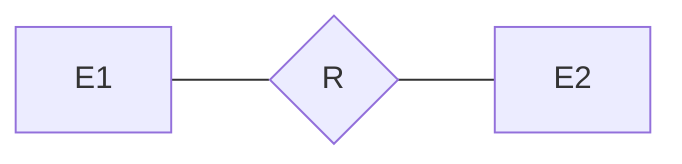
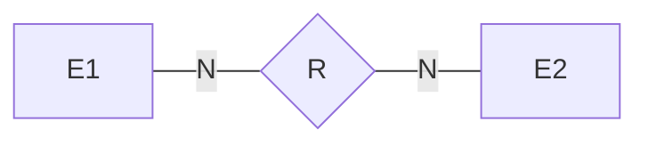
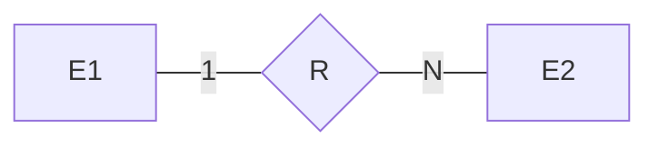
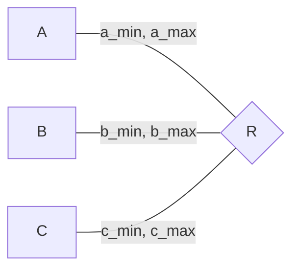
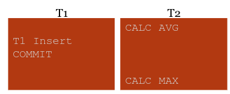
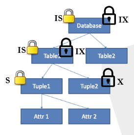
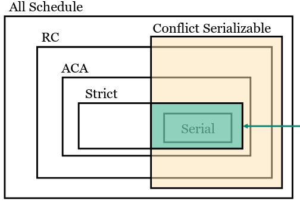
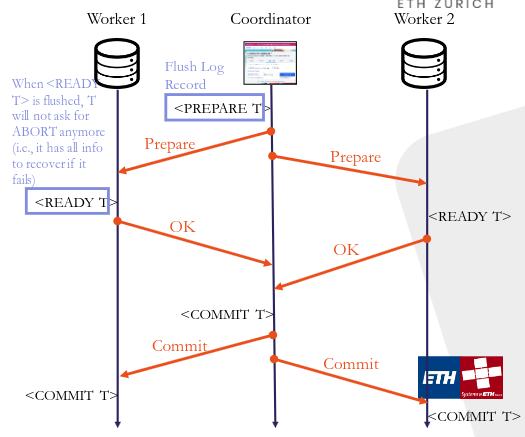
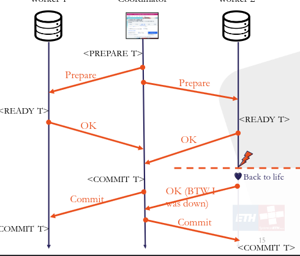
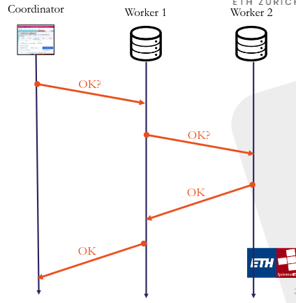

# Data Modelling and Databases Summary
Nicola Studer <[nicstuder@student.ethz.ch](mailto:nicstuder@student.ethz.ch)>,

All screenshots are directly taken from the lecture notes. All copyrights belong to the respective owners. Some mermaid graphs are made by the mighty [Cryptric](https://github.com/cryptric).

- [Data Modelling and Databases Summary](#data-modelling-and-databases-summary)
  - [Different types of databases](#different-types-of-databases)
    - [Hierarchial Model (IMS)](#hierarchial-model-ims)
    - [Network Model (Data Model)](#network-model-data-model)
    - [Relational Model](#relational-model)
  - [Relational Model](#relational-model-1)
    - [Relational Algebra](#relational-algebra)
    - [Relational Calculus](#relational-calculus)
      - [Semantics](#semantics)
    - [Domain Independent Relational Calculus](#domain-independent-relational-calculus)
    - [Conjunctive Query](#conjunctive-query)
    - [Bag Semantics](#bag-semantics)
  - [SQL](#sql)
    - [Data Definition Language (DDL)](#data-definition-language-ddl)
    - [Integrity Constraints](#integrity-constraints)
      - [REFERENTIAL constraints](#referential-constraints)
    - [Data Manipulation Language](#data-manipulation-language)
      - [Snapshot Semantics](#snapshot-semantics)
    - [Query language](#query-language)
      - [Recursive Queries](#recursive-queries)
    - [NULL and its semantics](#null-and-its-semantics)
      - [Commands that introduce NULL](#commands-that-introduce-null)
    - [Views](#views)
      - [Update Views](#update-views)
  - [Entity-Relationship Model](#entity-relationship-model)
    - [ER-Diagram](#er-diagram)
      - [Formal semantics](#formal-semantics)
      - [Cardinality](#cardinality)
      - [Extensions](#extensions)
      - [Principles](#principles)
    - [ER-Model to Relational Model](#er-model-to-relational-model)
  - [Functional Dependencies](#functional-dependencies)
    - [FD inference](#fd-inference)
      - [Computing the Minimal Basis](#computing-the-minimal-basis)
      - [Armstrong Axioms](#armstrong-axioms)
    - [Decomposition of Relations](#decomposition-of-relations)
  - [Normal Forms](#normal-forms)
    - [First Normal Form (1NF)](#first-normal-form-1nf)
    - [Seconds Normal Form (2NF)](#seconds-normal-form-2nf)
    - [Third Normal Form (3NF)](#third-normal-form-3nf)
      - [Synthesis Algorithm](#synthesis-algorithm)
    - [Boyce-Codd Normal form (BCNF)](#boyce-codd-normal-form-bcnf)
    - [Multi-value Dependency](#multi-value-dependency)
      - [Laws](#laws)
    - [Forth Normal Form (4NF)](#forth-normal-form-4nf)
      - [Decomposition Algorithm](#decomposition-algorithm)
  - [Analytics](#analytics)
    - [Data Cubes](#data-cubes)
    - [Rollup](#rollup)
  - [Database System Overview](#database-system-overview)
    - [Storage Hierarchy](#storage-hierarchy)
  - [Disk Manager (Storage Manager)](#disk-manager-storage-manager)
    - [File Storage](#file-storage)
    - [Heap File](#heap-file)
    - [Page Layout](#page-layout)
    - [Tuple Layout](#tuple-layout)
    - [Performance Model](#performance-model)
      - [Heap File: Linked list](#heap-file-linked-list)
      - [Heap File: Page directory](#heap-file-page-directory)
    - [OLAP vs OLTP](#olap-vs-oltp)
  - [Buffer (Pool) Manager](#buffer-pool-manager)
    - [Optimal Page Replacement](#optimal-page-replacement)
  - [Access Methods](#access-methods)
    - [Sequential Scan](#sequential-scan)
    - [B-Tree (B+ Tree)](#b-tree-b-tree)
      - [Unclustered B+Tree](#unclustered-btree)
      - [Clustered B+Tree](#clustered-btree)
      - [Runtime and Algorithms](#runtime-and-algorithms)
    - [Hash Table](#hash-table)
      - [Closed Hashing (Linear Probe)](#closed-hashing-linear-probe)
      - [Open Hashing](#open-hashing)
  - [Operator Execution](#operator-execution)
    - [Selection $\\sigma\_C(R)$](#selection-sigma_cr)
    - [Sorting](#sorting)
      - [External Sort](#external-sort)
    - [Join](#join)
      - [Nested Loop Join](#nested-loop-join)
      - [Block Nested Loop Join](#block-nested-loop-join)
      - [Index Nested Loop Join](#index-nested-loop-join)
      - [Sort Merge Join](#sort-merge-join)
      - [Hash Join (equi-join)](#hash-join-equi-join)
  - [Query Optimization](#query-optimization)
    - [Execution Model](#execution-model)
      - [Iterator Model](#iterator-model)
      - [Materialization Model](#materialization-model)
      - [Vectorization Model](#vectorization-model)
    - [Search Space](#search-space)
    - [Cost Model](#cost-model)
    - [Search Algorithm](#search-algorithm)
  - [Transactions](#transactions)
    - [Strawman Implementation](#strawman-implementation)
    - [Isolation](#isolation)
      - [Isolation Levels](#isolation-levels)
      - [Conflict Serializability](#conflict-serializability)
  - [Locking](#locking)
    - [Two Phase Locking (2PL)](#two-phase-locking-2pl)
    - [Strict Two Phase Locking (Strict 2PL)](#strict-two-phase-locking-strict-2pl)
    - [Granularity of Locks](#granularity-of-locks)
    - [Lock Compatibility Matrix](#lock-compatibility-matrix)
      - [Isolation Levels with Locks](#isolation-levels-with-locks)
  - [Timestamp Concurrency Control](#timestamp-concurrency-control)
    - [Snapshot Isolation](#snapshot-isolation)
  - [Recovery](#recovery)
    - [Recoverable (RC) schedule](#recoverable-rc-schedule)
    - [Avoids Cascading Aborts (ACA) Schedule](#avoids-cascading-aborts-aca-schedule)
    - [Strict (ST) Schedule](#strict-st-schedule)
    - [Write-ahead log](#write-ahead-log)
      - [Undo Logging](#undo-logging)
      - [Redo Logging](#redo-logging)
      - [Undo/Redo Logging](#undoredo-logging)
  - [Distributed Database Systems](#distributed-database-systems)
    - [Two Phase Commit](#two-phase-commit)
    - [Linear Two Phase Commit](#linear-two-phase-commit)
    - [Distributed Query Processing](#distributed-query-processing)
      - [Naïve Table Partitioning](#naïve-table-partitioning)
      - [Horizontal Partitioning](#horizontal-partitioning)
      - [Distributed Query Optimizer](#distributed-query-optimizer)
      - [Replication](#replication)
    - [Distributed Key-Value Store](#distributed-key-value-store)
      - [Single Machine Implementation](#single-machine-implementation)
      - [Multiple Machines Implementation](#multiple-machines-implementation)


## Different types of databases
**Database**: Collection of data / facts.

**Database Management System (DBMS)**: Software designed to assist in maintaining and utilizing large collections of data. It should have the following properties:
- **Data Independence**: Application should not know how data are stored.
- **Efficient Data Access**: The system should be able to store and retrieve data efficiently, without users worrying about it (too much)
- **Transactional Access**: As if there is only a single user using a system that does not fail
- **Generic Abstraction**: Users do not need to worry about all the above issues fo each new query.

### Hierarchial Model (IMS)
Database schema is a hierarchy (tree) of record types, which are tuples. A query essentially traverses the tree one record-at-a-time.

Problems:
- Too restrictive because of tree structure
- Do not provide (physical) data Independency
- Require manual query optimization

### Network Model (Data Model)
Database schema is a network of record types. A query traverses the network (graph) one record-at-a-time.

Problems:
- Do not provide (physical) data independency.
- Require manual query optimization.

### Relational Model
Database schema is composed as a set of relations, which are sets of tuples of the same type. A query is a set operation over relations with one set-at-a-time.

## Relational Model
Represent knowledge as a collection of facts, and doing inference using *mathematical logic*.

**Database Schema**: A Set of Relation Schemas

**Relation Schema**: $R(f_1: D_1, \ldots, f_n: D_n)$

**Instance**: $I_R \subseteq D_1 \times \ldots \times D_n$, content of the "relation".

**Candidate Key**: Minimal set of fields that identify each tuple uniquely.

**Primary Key**: One candidate key; marked in Schema by underlining.

**Valid Instances**: $R(\underline{k: D_k}, a: D_a, b:D_b): I \subseteq D_k \times D_a \times D_b \land \forall (k, a, b), (k', a', b') \in I, k = k' \implies (a, b) = (a', b')$.

> In general every relation must have a key.

### Relational Algebra

**Query**: Is a function that takes as input a DB instance, output a new relation.

**Query Language**: Consists of a set of functions that you can express in that language.

| Symbol            | Name                | Definition                                                                                                                 |
| ----------------- | ------------------- | -------------------------------------------------------------------------------------------------------------------------- |
| $\cup$            | Union               | $x \in R_1 \cup r_1 \iff x \in R_1 \land x \in R_2$                                                                        |
| $-$               | Difference          | $x \in r_1 - R_2 \iff x \in R_1 \land \not(x \in R_2)$                                                                     |
| $\cap$            | Intersection        | $R_1 \cap R_2 = R_1 - (R_1 - R_2)$                                                                                         |
| $\sigma$          | Selection           | $\sigma_c(R) \iff x \in R \land c(x) = \text{True}$                                                                        |
| $\Pi$             | Projection          | $\Pi_{A_1, \ldots A_n}(R)$ (keep subset of columns)                                                                        |
| $\times$          | Cartesian Product   | $(x, y) \in R_1 \times R_2 \iff x \in R_1 \land y \in R_2$                                                                 |
| $\rho$            | Renaming            | $\rho_{B_1, \ldots, B_n}(R)$ (change name of attributes)                                                                   |
| $\bowtie$         | Natural Join        | $R_1(A, b) \bowtie R_2(B, C) = \Pi_{A, B, C}(\sigma_{R_1.B = R_2.B}(R_1 \times R_2))$                                      |
|                   |                     | $R(A, B, C) \bowtie S(D, E) \iff R \times S$                                                                               |
|                   |                     | $R(A, B, C) \bowtie S(A, B, C) \iff R \cup S$                                                                              |
| $\bowtie_\theta$  | Theta Join          | $R_1 \bowtie_\theta R_2 = \sigma_\theta(R_1 \times R_2)$                                                                   |
| $\bowtie_{A = B}$ | Equi-Join           | $R_1 \bowtie_{A = B} R_2 = \sigma_{A = B}(R_1 \times R_2)$                                                                 |
| $\div$            | Relational Division | $R \div S = \Pi_{R-S} R - \Pi_{R-S}((\Pi_{R-S}R) \times S - R)$ (find all $k_1$, which have an instance with all of $k_2$) |
| $\ltimes_C$       | Semi-Join           | $R_1(A_1, \ldots, A_n) \ltimes_c R_2(B-1, \ldots, B_m) = \Pi_{A_1, \ldots A_n}(R_1 \bowtie_c R_2)$                         |

We have some further consequences: $R \bowtie S = (R \ltimes \Pi_B S) \bowtie S$.

One can compose multiple operations together to form a relational algebra expression.

### Relational Calculus
Relations are **facts**, let's query it with **logic**. Relational Calculus thus is a query language, which tells the system WHAT we want, instead of HOW to get it.

**New operations**:
| Symbol   | Definition              |
| -------- | ----------------------- |
| $\delta$ | Duplication elimination |
| $\pi$    | Sorting                 |
| $\gamma$ | Group-and-aggregation   |

**Database Schema**: $S = (R_1, \dots, R_m)$  where $R_i$ is a relation.

**Relation Schema**: $R(A_1: D_1, \ldots, A_n: D_n)$

**Domain**: $\text{dom} = \bigcup_i D_i$ infinite set of constants.

**Instance of Relation**: $R(A_1: d_1, \ldots, A_n: D_n): I_R \subseteq \text{dom}^n$ and $I_R$ is a finite set of facts over the relation.

**Instance of Database schema**: $S(R_1, \ldots R_m): \mathbb{I}$ a function that maps $R_i$ to an instance of $R_i$. Is a finite set of facts over all relations.

#### Semantics
Let $\phi$ be a first-order logic formula with free variables $x_1, \ldots, x_k$. Then $Q_\phi = \{(x_1, \ldots, x_n) \mid \phi\}$ is a domain relational calculus query.
- Each **relation** $R$ corresponds to a **predicate** $R$ in $\phi$
- Each **instance** $\mathbb{I}$ corresponds to a **first-order interpretation** $\mathbb{I}$
- An **assignment** is a mapping $\alpha: var \to \text{dom}$.
- The answer of $Q$ over $\mathbb{I}$ is $Q(\mathbb{I}) = \{(\alpha(x_1), \ldots, \alpha(x_k)) \mid \mathbb{I}, \alpha \vDash \phi\}$

> The answer of a relational calculus query does **not have to be finite** (e.g. $Q_\phi = \{(x_1, \ldots, x_k) \mid \lnot R(x_1, \ldots, x_n)\}$) for instance $\mathbb{I} = \{\}$.

We save a $Q_\phi$ is **safe** if $\forall \mathbb{I}: Q_\phi(\mathbb{I})$ is finite.

### Domain Independent Relational Calculus
A query where the answer depends not only on the interpretation of the relations, but also on the domain is called **domain dependent**.

We introduce some new definitions:
- **Active domain**: $adom(Q_\phi, \mathbb{I}) =$ all constants in $Q_\phi$ and $\mathbb{I}$.
- **Active Domain Semantics** for $Q_\phi$:
  - $Q_{adom(\phi, \mathbb{I})} = \{(x_1, \ldots, x_n) \mid \phi \land \forall i, x_i \in adom(\phi, \mathbb{I})\}$
  - Also all quantifier $\forall v_1, \exists v_1$ in $\phi$ becomes $\forall v_i \in adom(\phi, \mathbb{I}), \exists v_i \in adom(\phi, \mathbb{I})$.

Thus relational calculus under Active Domain Semantics always return finite answer.

**Codd's Theorem**: Domain-independent RC is a powerful as RA.

In databases the user writes RC, where the system then automatically find the best RA and because of Codd's theorem, this is always possible.

### Conjunctive Query
We still have two major problems with DI-RC:
1. Given a DI-RC query $\phi$, does there exist a DB instance such that it outputs non-empty answers? **Satisfiability - Undecidable**.
2. Given two DI-RC queries $\phi_1, \phi_2$, are they equivalent under all possible instances? **Equivalence - Undecidable**.

**Conjunctive Query** is an extension, such that these problems can be easier solved.
$\phi = \exists y_1, \ldots, y_l(A_1 \land \ldots \land A_m)$, with $Q_\phi = \{(x_1, \ldots, x_n) \mid \phi\}$ where each $A_j$ is an atom (= 1 predicate).

**SPJR Algebra**: RA with only **Selection, Projection, Join** and **Renaming** 

> CQ is as expressive as SPJR Algebra.

Furthermore we have the property, that CQ is monotonic: $\mathbb{I}_1 \subseteq \mathbb{I}_2 \implies Q(\mathbb{I}_1) \subseteq Q(\mathbb{I}_2)$.

### Bag Semantics
Real databases uses Bag semantics instead of set semantics, where a bag can have duplicate tuples in the same relation. SQL relations all have BAG semantics. In our definition each relational model is a set.

**Examples**:
- Bag Union: $\{1, 2, 1\} \cup \{1, 2, 3\} = \{1, 1, 1, 2, 2, 3\}$.
- Bad Difference: $\{1, 2, 1\} - \{1, 2, 3, 3\} = \{1\}$

## SQL
SQL is a family of standards:
- Data definition language (DDL)
- Data manipulation language (DML)
- Query Language

### Data Definition Language (DDL)
Provides statements to defined the schema.

```sql
-- creation
CREATE TABLE Professor(
  PersNr integer,
  Name varchar (30),
  Level character(2) default 'AP',
  PRIMARY KEY (PersNr)
);

-- deletion
DROP TABLE Professor;

-- Modify table
ALTER TABLE Professor ADD COLUMN (age
integer);

ALTER TABLE Professor DROP COLUMN age;
```

### Integrity Constraints
Define the set of *valid DB* instances.The DB makes sure changes are consistent and do not cause troubles later on, thus controlling the content of the data and its consistency as part of the schema.

**PRIMARY KEY constraint**: A certain attribute needs to be *unique* and *not NULL*. We can define PRIMARY KEY over multiple attributes, but only one per relation.
```sql
CREATE TABLE tbl1 (
  field1 int,
  field2 int,
  field3 int,
  PRIMARY KEY (field2, field3)
);
```

**UNIQUE constraint**: A certain attribute needs to be unique. It is different from Primary Key as it can be NULL. Furthermore it can span multiple columns.
```sql
CREATE TABLE tbl1 (
  field1 int UNIQUE,
  field2 int,
  field3 int,
  UNIQUE (field1, field2)
);
```

**CHECK constraint**: Conduct local checking of the value of attributes (local in the sense that you take as input a tuple and check whether it satisfies some constraints).
```sql
CREATE TABLE tbl1 (
  field1 int,
  field2 int,
  field3 itn,
  check(field1 >= 4 AND field2 < 5)
);
```

> If the condition in the check results in `Unknown`, it accepts **all** inputs.

#### REFERENTIAL constraints

**Foreign Keys**: Refer to tuple from a different relation. For every foreign key one of the following two conditions must hold:
1. The value of the foreign key is `NULL`
2. The referenced tuple must exist

```sql
CREATE TABLE tbl1 (
  id int primary key,
  foreign_field int REFERENCES tbl2.field
);
```

There are many more maintenance constraints:
- **Cascade**: Propagate update or delete
- **Restrict**: Prevent deletion of the primary key before trying to do the change, cause error
- **No Action**: Prevent modifications after attempting the change, cause an error
- **Set default, set null**: Set references to NULL or to a default value

```sql
CREATE TABLE tbl1 (
  id int primary key,
  foreign_field int REFERENCES tbl2.field ON DELETE {cascade |restrict | no action | set null | set default}
)
```

### Data Manipulation Language
How can we modify/add/delete data in our database. This should be learned with practice, not this theory. Thus this chapter is really short without much explanation.

```sql
-- inserts
INSERT INTO Student (PersNr, Name)
VALUES (28121, `Frey`)

-- delete
DELETE Student
WHERE Semester > 13;

-- update
UPDATE Student
SET Semester = Semester + 1;
```

(**ETL**) Automatic tools are used to
- **Extract**: get data from some file
- **Transform**: apply transformation to the data when needed
- **Load**: insert into the DB as a bulk operation

```sql
INSERT INTO Professor VALUES (2125, ‘John’, ‘AP’, 226);
INSERT INTO Professor VALUES (2126, ‘David’, ‘FP’, 232);
INSERT INTO Professor VALUES (2127, ‘Anna’, ‘FP’, 310);

--bulk load
COPY Professor FROM ‘/profs.csv’ WITH FORMAT csv;
```

#### Snapshot Semantics
When we have an update on the relation where the condition is dependent on the data of the same relation, SQL goes trough two phases:
1. *Mark* all tuples which are affected by the updates.
2. *Implement*  updates on the marked tuples.

### Query language
Every RA expression can be written in a subset of SQL:

| Function | Example           | SQL                                       |
| -------- | ----------------- | ----------------------------------------- |
| $\cup$   | $R_1 \cup R_2$    | `(SQL 1) UNION (SQL 2)`                   |
| $-$      | $R_1 - R_2$       | `(SQL 1) EXCEPT (SQL 2)`                  |
| $\sigma$ | $\sigma_C(R)$     | `SELECT * FROM (SQL 1) WHERE c;`          |
| $\Pi$    | $\sigma_C(R)$     | `SELECT * FROM (SQL1) WHERE c;`           |
| $\times$ | $R_1 \times R_2$  | `SELECT * FROM (SQL 1), (SQL 2);`         |
| $\rho$   | $\rho_{a, b, c}R$ | `SELECT A as a, ..., C as c FROM (SQL 1)` |

Some further examples:
```sql
-- sorting
SELECT PersNr, Name, Level
FROM Professor
ORDER BY Level DESC, Name DESC;

-- Grouping, Aggregation
SELECT Level, COUNT(*)
FROM Professor
GROUP BY Level;

-- Filter groups with conditions
SELECT p.PersNr, Name, sum (CP)
FROM Lecture l, Professor p
WHERE l.ProfNr= p.PersNr and level =  ́FP ́
GROUP BY p.PersNr, Name
HAVING avg (CP) >= 3;

-- Existential Quantification (uncorrelated subquery)
SELECT p.Name
FROM Professor p
WHERE p.PersNr NOT IN
(SELECT PersNr FROM Lecture);

-- Existential Quantification (correlated subquery)
SELECT p.Name
FROM Professor p
WHERE NOT EXISTS (SELECT *
FROM Lecture l
WHERE l.PersNr = p.PersNr);
```

#### Recursive Queries
SQL provides an easy way to express recursion inside queries. The basic notation look like:
```sql
WITH RECURSIVE R AS ('base query' UNION 'RECURSIVE QUERY')
<Query involving R and other tables>
```

The `base query` is really the base case, which can be run in the table without the recursion!

To execute it SQL has the following algorithm:
1. Set `R = Empty`
2. Run (`base query UNION recursive query`) and set it as the new `R`.
3. Repeat until `R` does not change.

An example could look like:
```sql
WITH RECURSIVE AncestorOfD(ancester) AS -- Recursive Relation AncestorOfD with Attribute ancester
(SELECT parent FROM ParentOf WHERE child = D -- base case
 UNION
 SELECT p2.parent FROM AncestorofD p1, ParentOf p2 WHERE p1.ancester = p2.child) -- Recursive Query
SELECT * FROM AncesterOfD; -- The query
```

As SQL implements first-order logic it is thus not able to express the transitive closure.
Thus we have to be sure that AncestorOfD eventually will not change anymore, or else the Query will not terminate.

### NULL and its semantics
First of all: **NULL is a state, not a value**. NULL means "I don't know", which means that it could take any value in the domain. The DB is conservative when it tries to give you an answer.

**Arithmetics**:
- `(NULL + 1) -> NULL`
- `(NULL * 0) -> NULL`

**Comparisons**:
- `(NULL = NULL) -> Unknown`
- `(NULL < 13) -> Unknown`
- `(NULL > NULL) -> Unknown`

**3-value Logic**:
| not     |         |
| ------- | ------- |
| true    | false   |
| unknown | unknown |
| false   | true    |

| and         | true    | unknown | false |
| ----------- | ------- | ------- | ----- |
| **true**    | true    | unknown | false |
| **unknown** | unknown | unknown | false |
| **false**   | false   | false   | false |

| or          | true | unknown | false   |
| ----------- | ---- | ------- | ------- |
| **true**    | true | true    | true    |
| **unknown** | true | unknown | unknown |
| **false**   | true | unknown | false   |

**Extras**:
- `(NULL = NULL) -> Unknown`
- `(NULL IS NULL) -> True`
- `NULL` in Group By: All NULLs form a single group
- `NULL` in values: Most operators will ignore the NULL value (e.g. `COUNT(*)` will not ignore NULL, but `COUNT(FIELD)` will ignore it)
- `NULL` in values: When there is nothing $\to$ NULL.

#### Commands that introduce NULL
- **Left Outer Join**: Keep unmatched tuple on the left and fill the missing values with `NULL`.
- **Right Outer Join**: Keep unmatched tuple on the right and fill the missing values with `NULL`.
- **Outer Join**: Keep unmatched tuple on both the left and the right and fill the missing values with `NULL`.

### Views
Where as **relation** is a powerful abstraction that provides us *physical data independence*, a **view** aims to raising the level of abstraction even higher and provides us with *logical data independence*.

A view is the result set of a stored query on the data, which the database users can query just as they would in a persistent database collection object.

```sql
CREATE VIEW FlightFromPEK AS
SELECT * FROM Flight WHERE orig=PEK;
```

Logically, the table `FlightFromPEK` has never been materialized.

Views have many different applications:
- **Privacy**: View can be used for access control and preserving privacy.
- **Usability**: View can be used to make writing of some queries easier.
- **Generalization**: View can be used to implement generalization.

#### Update Views
SQL tries to avoid indeterminism and thus is conservative with respect to view updates. A SQ views is updatable iff:
1. The view involves only **one** base relation
2. The view involves the key of that base relation
3. The view does **not** involve aggregates, group by, or duplicate-elimination.

Keep unmatched tuple on the left and fill the missing values with `NULL`

## Entity-Relationship Model
An Entity-Relationship Model models an application into **Entity sets, Attributes** and **Relationships**.

**Entity sets**: A set of similar entities. Models an object in the real word that is distinguishable from other objects. Entities of an entity set share the same **attributes**.

**Relationships**: Connections among two or more entity sets.

### ER-Diagram
Is a graphical way of representing entities and the relationships among them.

Not all attributes are the same. Some attributes form a **key**, which is a minimal set of attributes whose values uniquely identify an entity in the set. There might be multiple keys, which are called **Candidate Keys**, but only one is called **Primary Key**, which is underlined in the ERD. Each entity must have a primary key.

**Role**: Role in the relationship.


ER-Diagram is a constraint language, defining the set of **Valid DB** instances.

#### Formal semantics
We define all values we can take by $\mathcal{D} = \mathcal{B} \cup \Delta$, where $\mathcal{B}$ is the set of concrete values (int, string, floating point, etc.) and $\Delta$ defines the abstract values (corresponding to the entity).

**Entity set** $E$: 1-ary Predicate $E(x)$. ($E(x) =$ True if $x$ is of Entity Type E).

**Attribute** $A$: binary Predicate $A(x, y)$. ($A(x, y) =$ True if $x$ has attribute $y$)

**n-ary Relation** $R$: n-ary Predicate $R(x_1, \ldots, x_n)$. ($R(x_1, \ldots, x_n) =$ True if $(x_1, \ldots, x_n)$ participate in R)

A first order interpretation $\mathcal{J}$ satisfies:
- $E^\mathcal{j} \subseteq \Delta$
- $A^\mathcal{j} \subseteq \Delta \times \mathcal{B}$
- $R^\mathcal{j} \subseteq \Delta^n$

Thus each subgraph introduces a first-order logic sentence. For example

is equivalent to $\forall x_1 \in \Delta, x_2 \in \Delta. R(x_1, x_2) \implies E_1(x_1) \land E_2(x_2)$.


is equivalent to $\forall x, E(x) \implies \exists^{=1}y. a(x, y) \land y \in \mathcal{B}.$ where $\exists^{=1}$ stands for uniquely exists.

#### Cardinality

**Many-to-many**: An entity of type E1 can have multiple relationships with entity of type E2.



**One-to-many**: An entity of type E1 can only be in relation with 1 entity of type E2.

which specifies a new constraint in first-order logic: $\forall x_{E1}, x_2. R(x_{E1}, x_{E2}) \implies \lnot \exists x_{E1}'. R(x_{E1}', x_{E2}) \land x_{E1}' \neq x_{E2}$. Thus in general if there are more entity sets involved in the relation the 1 in front of E1 that there is one E1 for each set of the other entities.

Furthermore we can have another notation describing the same thing but with a (min/max) approach which is more expressive:

Which specifies the following constraints:
- $\forall x_A. A(x_A) \implies \exists^{\geq a_{min}, \leq a_{max}}x_B', x_C'. r(x_A, x_B', x_C')$
- $\forall x_B. B(x_B) \implies \exists^{\geq b_{min}, \leq b_{max}}x_A', x_C'. r(x_A', x_B, x_C')$
- $\forall x_C. C(x_C) \implies \exists^{\geq c_{min}, \leq c_{max}}x_A', x_B'. r(x_A', x_B', x_C)$

with $\exists^{\geq c_{min}, \leq c_{max}}$ uniquely exists at least $c_{min}$ and at most $c_{max}$ instances.

#### Extensions
**Weak Entities**: Some entities rely on other entities.


Here in this example Room is a weak entity relying on Building, where the key of Room is $(\underline{\text{Bld}}, \underline{\text{Room}})$. This also implies that there cannot be a room without a building.

**Generalization**: Enables us to represent the information that multiple entities are of type of another entity.


Here Professor and Student share Person's attributes as well as primary keys.

#### Principles
1. Reflect reality
2. Avoid redundancy
3. Keep it simple
4. No tricks to improve redundancy
5. Less entities is better
6. Concise, correct, complete, comprehensive

### ER-Model to Relational Model
- Entities become relations.
- Relationships become relations.
- Merge relations with the same key
- Generalization
- Weak Entities
- Entity sets become tables
- Attributes of entity set become attributes of the table

When modelling cardinalities one has to be aware that there might be multiple solutions. Furthermore sometimes some entities can be merged together, but it doesn't make sense always. Thus it is only possible to (semi-)-automatically generate a Relational Model from ER.

> This algorithm automatically generates at least 3NF! (See [Third Normal Form (3NF)](#third-normal-form-3nf))

## Functional Dependencies
A bad database schema can lead to update-anomalies, insert-anomalies and delete-anomalies. This directly leads to data redundancy, which should be prevented.
There are some major problems with data redundancy:
- Waste of storage space
- Additional work to keep multiple copies of accommodate one event
- Additional code to keep multiple copies of data consistent

But data redundancy is not always bad, as it can improve locality and sometimes it is even needed for fault tolerance and availability.

The setup for this chapter is as follows:
Schema: Relation $\mathcal{R}(A: D_A, B: D_B, C: D_C, D:D_D)$ with instance $R \subseteq D_A \times D_B \times D_C \times D_D$. Let $\alpha \subseteq \mathcal{R}, \beta \subseteq \mathcal{R}$, such that $\alpha, \beta$ are subsets of columns/attributes.

**Functional Dependency**: $\alpha \to \beta$ iff $\forall r, s \in R: r.\alpha = s.\alpha \implies r.\beta = s.\beta$.
In other word for any two tuples $r$ and $s$ in DB instance $R$, if $r$ and $s$ share the ame value on columns $\alpha$, then they share the same values on column $\beta$. Or even in "mathy" terms: there is a function mapping values in columns $\alpha$ to values in columns in $\beta$.

We write $R \vDash \alpha \to \beta$ if $\R$ satisfies $\alpha \to \beta$.

**Superkey**: $\alpha \subseteq \mathcal{R}$ is superkey iff $\alpha \to \mathcal{R}$ (all columns). $\implies \alpha$  must be a superset of a key.

**Minimal**: $\alpha \to \beta$ is minimal iff $\forall A \in \alpha: (a - \{A\}) \not\to \beta$ and its denoted as $\alpha \to^\cdot \beta$ with a small dot above the arrow.

**Candidate Key**: $\alpha \subseteq \mathcal{R}$ is candidate key iff $\alpha \to^\cdot \mathcal{R}$.

> Cardinalities define functional dependencies, which determine keys for the relation. But not all functional dependencies are derived form the cardinality information.

### FD inference
Given a set F of FDs on a scheme $\mathcal{R}$, can we derive $\alpha \to \beta$ on $\mathcal{R}$ out of F? We have two different ways to defined that:
- $F \vDash \alpha \to \beta$: Semantics (**implies**), if every relation instance $R$ of $\mathcal{R}$ that satisfies all FDs in $F$ also satisfies $\alpha \to \beta$.
- $F \vdash \alpha \to \beta$: Syntax. We can **derive** $\alpha \to \beta$ by applying a set of inference rules (Armstrong's axioms) over $F$.

Thus we get the following result if $\vdash$ is defined by Armstrong's Axioms:
$$F \vDash \alpha \to \beta \iff F \vdash \alpha \to \beta$$

**Closure**: The close of $F$, denoted by $F^+$ is the set of all FDs implied by $F$.

**Equivalent**: Let $F$ and $G$ be sets of FDs on scheme $\mathcal{R}$. Then F and G are equivalent, denoted by $F \equiv G$ if $F \vDash G$ and $G \vDash F$.

**Minimal Cover/Basis**: A minimal cover of $F$ is a set of FDs $G$ that has the following properties:
- $G \equiv F$
- All FDs in $G$ have the form $X \to A$ where $A$ is a single attribute
- It is not possible to make $G$ smaller
  - Deleting a FD i.e. $G - \{X \to A\} \not\equiv G$ for any FD $X \to A$
  - Deleting an attribute form the left hand side of a FD. i.e. $G - \{XA - B\} + \{X \to B\} \not\equiv G$ for any FD $XA \to B \in G$.

#### Computing the Minimal Basis
1. Let $G$ be the set of DFs obtained from $F$ by decomposing the right-hand sides of each FD to a single attribute.
2. Remove FDs that are trivial
3. Remove all redundant attributes from the left-hand sides of FDs in $G$.
   1. For each $X \to Y$ take each attribute $x$ in $X$, if $X - \{x\} \to Y$ implies $X \to Y$, then replace $X \to Y$ with $X - \{x\} \to Y$
4. From the resulting set of FDs, remove all redundant FDs.

#### Armstrong Axioms
**Reflexivity**: $\alpha \subseteq \beta \implies \beta \to \alpha$ with special case $\mathcal{R} \to \alpha$. We call these FDs **trivial FDs**.

**Augmentation**: $\alpha \to \beta \implies \alpha \gamma \to \beta \gamma$ ($\alpha \gamma := \alpha \cup \gamma$).

**Transitivity**: $\alpha \to \beta \land \beta \to \gamma \implies \alpha \to \gamma$.

> These three axioms are both **complete** and **sound**. All possible other FDs canbe implied from these axioms.

**Closure with respect to some $\alpha$**: Let $F$ be a set of FDs over $\mathcal{R}$, $\alpha \subseteq \mathcal{R}$ is a set of attributes of $\mathcal{R}$. The close of $\alpha$ with respect to $F$, $\alpha+$, is the set of all attributes $y \in \mathcal{R}$ such that $\alpha \to y$ can be derived from $F$ using Armstrong's axioms.
$$\alpha^+ = \{y \in \mathcal{R} \mid f \vdash \alpha \to \gamma\}$$
Thus we have $$F \vdash \alpha \to \beta \iff \beta \subseteq \alpha^+$$

There is an algorithm to create the transitive closure for some $\alpha$:
$$
\begin{align*}
&\alpha^+ = \alpha \\
&\text{repeat} \\
&\quad \alpha_{old}^+ := \alpha^+\\
&\quad\text{for each FD } \beta \to \gamma \in \text{F} \\
&\quad\quad\quad\text{if } \beta \subseteq \alpha^+ \text{ then } \alpha^+ := \alpha^+ \cup \gamma \\
&\text{until }\alpha^+ = \alpha_{old}^+ \\
&\text{output } \alpha^+
\end{align*}
$$

We have some more rules:
- **Union of FDs**: $\alpha \to \beta \land \alpha \to \gamma \implies \alpha \to \beta\gamma$
- **Decomposition**: $\alpha \to \beta \gamma \implies \alpha \to \beta \land \alpha \to \gamma$.
- **Pseudo transitivity**: $\alpha \to \beta \land \beta\gamma \to \theta \implies \alpha\gamma \to \theta$.

### Decomposition of Relations
Bad relations combine several concepts, thus we need to decompose them so that each concept is in one relation.

**Lossless Decomposition**: $R = R_1 \bowtie R_2 \bowtie \ldots \bowtie R_n$

**Preservation of Dependencies**: $FD(R)^+ = [FD(R_1) \cup \ldots \cup FD(R_n)]^+$

For example let $\mathcal{R} = \mathcal{R}_1 \cup \mathcal{R}_2$ be a relation and $R_1 = \Pi_{\mathcal{R}_1}(R), R_2 = \Pi_{\mathcal{R}_2}(R)$. Then $R = R_1 \bowtie R_2$ if either $(\mathcal{R}_1 \cap \mathcal{R}_2) \to \mathcal{R}_1$ **or** $(\mathcal{R}_1 \cap \mathcal{R}_2) \to \mathcal{R}_2$.

## Normal Forms
Normal forms describe properties of concrete schemas based on functional dependencies in terms of data redundancy and date integrity.

For the following we use $\{R, FD\}$ where $R$ is a relation and $FD$ the functional dependencies on it.

### First Normal Form (1NF)
A relation is in 1NF if all domains are atomic. It happens when representing an 1-N relationship with an array for the N side, instead the N side should be represented as different tuples.

For example the following table is not in 1NF:
| Field1 | Field2 | Field3 |
| ------ | ------ | ------ |
| A      | B      | {C, D} |
| E      | F      | {G, H} |

It should be transformed into
| Field1 | Field2 | Field3 |
| ------ | ------ | ------ |
| A      | B      | C      |
| A      | B      | D      |
| E      | F      | G      |
| E      | F      | H      |

and **not** into
| Field1 | Field2 | Field3.1 | Field3.2 |
| ------ | ------ | -------- | -------- |
| A      | B      | C        | D        |
| E      | F      | G        | H        |

even if this is in 1NF. It is not a good approach because Field3.1, Field3.2 represent the same thing.

> But sometimes an array type is needed (e.g. pay by quarter, or a schedule)

### Seconds Normal Form (2NF)
2NF tries to remove data redundancy caused by similar cases. "$\approx$ Everything depends on the key" (2NF: Everything depends on **every** key).

$\{R, FR\}$ is in 2NF iff every non-key attribute is minimally dependent on every key, where minimally dependent means that no attribute depends on part of a key.

Problems for relations that are not in 2NF:
- Insert Anomaly
- Update Anomaly
- Delete Anomaly

**Enforce 2NF**:
- Take the "evil" FD and decompose the relation into multiple relations (By splitting up the key).
- Lossless Decomposition: The join returns the origin al table, but we eliminate some FDs.

### Third Normal Form (3NF)
$R$ is in 3NF iff for all $\alpha \to B$ at least one condition holds:
- $B \in \alpha$ (thus $\alpha \to B$ is a trivial FD).
- $B$ is an attribute of at least one key
- $\alpha$ is a superkey of $R$ (superkey = superset of a candidate key)

If $\alpha \to B$ does not satisfy any of these conditions, $\alpha$ is a concept in its own right. It tries to get rid of transitive dependencies.

But even with third normal form we have
- Update anomaly
- Delete anomaly

#### Synthesis Algorithm
put: Schema $\mathcal{R}$.
Output: $\mathcal{R}_1, \mathcal{R}_2, \ldots, \mathcal{R}_n$ such that the decomposition is lossless and $\mathcal{R}_1, \ldots, \mathcal{R}_n$ are in 3NF.

1. Compute the minimal basis $Fc$ of $F$
2. For all $\alpha \to \beta \in F_c$ create $R_{\alpha \cup \beta}(\alpha \cup \beta)$
3. If none of the above relations contains a superkey, add a relation with a key
4. Eliminate $R_\alpha$ if there exists $R_{\alpha'}$ such that $\alpha \subseteq \alpha'$.

### Boyce-Codd Normal form (BCNF)
$R$ is in BCFN iff for all $\alpha \to B$ at least one condition holds:
- $B \in \alpha$ ($\alpha \to B$ is a trivial FD)
- $\alpha$ is a superkey of $R$.

Intuitively in each relation you only store the same information once. But it does not preserve all FDs. Furthermore it does not get rid of ALL data redundancies, only the redundancies cause by functional dependencies.

Cardinalities cannot be enforced completely through keys, but through constraints (make on the key, the other `UNIQUE`).

**Decomposition algorithm**:
Input: Schema $\mathcal{R}$.
Output: $\mathcal{R}_1, \mathcal{R}_2, \ldots, \mathcal{R}_n$ such that the decomposition is lossless and $\mathcal{R}_1, \ldots, \mathcal{R}_n$ are in BCNF.

Algorithm:
$$
\begin{align*}
&\text{Result} = \{\mathcal{R}\} \\
&\text{while(exists } \mathcal{R}_i \text{ in Result such that } \mathcal{R}_i \text{ is not BCNF}) \\
&\qquad \text{Let} \ \alpha \to \beta \ \text{be the evil FD} \\
&\qquad \mathcal{R}_i^1 = \alpha \cup \beta \\
&\qquad \mathcal{R}_i^2 = \mathcal{R}_i - \beta \\
&\qquad \text{Result} = (\text{Result} - \mathcal{R}_i) \cup \{\mathcal{R}_i^1, \mathcal{R}_i^2\} \\
&\text{Output Result}
\end{align*}
$$

Or in words:
1. Generate Closure from all FDs
2. Find Candidate Keys
3. Check each FD and see whether Relation is in BCNF
4. Decompose the relation if necessary
5. Repeat Step 2-4 fo each new relation.

The order of picking the evil FD matters. Heuristics prioritize the one with the largest RHS.

### Multi-value Dependency
$\alpha \to \to \beta$ for $R(\alpha, \beta, \gamma)$ iff $\forall t_1, t_2 \in R, t_1.\alpha = t2.\alpha \implies \exists t_3, t_4 \in R:$
- $t_3.\alpha = t_4.\alpha = t_1.\alpha = t_2.\alpha$
- $t_3.\beta = t_1.\beta; t_4.\beta = t_2.\beta$
- $t_3.\gamma = t_2.\gamma; t_4.\gamma = t_1.\gamma$

For example {PersNr} ->-> {Language}, {PersNr} ->-> {Programming} means that if we add a language for somebody, we have to add a tuple for every programming language that that person knows.

This can result in anomalies and redundancy as it forces the creation of additional, redundant tuples.

An intuitive way to think about MVD is to think about it in terms of joins. $R(\alpha, \beta, \gamma)$, if $\alpha \to\to \beta$ then we can decompose $R$ losslessly into
- $R_1 = \Pi_{\alpha, \beta}R$
- $R_2 = \Pi_{\alpha, \gamma}R$
- $R = R_1 \bowtie R_2$

#### Laws
**Trivial MVDs**:
- $\mathcal{R}(\alpha, \theta): \alpha \to \to \alpha \theta. \ (\alpha \to \to \mathcal{R})$
- $\mathcal{R}(\alpha, \theta): \alpha \to \to \theta. \ (\alpha \to \to \mathcal{R} - \alpha)$
- $\beta \subseteq \alpha \implies \alpha \to \to \beta$

**Promotion**: $\alpha \to \beta \implies \alpha \to \to \beta$

**Complement**: $\alpha \to \to \beta \implies \alpha \to \to \mathcal{R} - \alpha - \beta$

**Multi-Value Augmentation**: $\alpha \to \to \beta \land (\delta \subseteq \gamma) \implies \alpha \gamma \to \to \beta \delta$

**Multi-Value Transitivity**: $(\alpha \to \to \beta) \land (\beta \to \to \gamma) \implies \alpha \to \to \gamma$

### Forth Normal Form (4NF)
$R$ is in 4NF iff for all $\alpha \to \to \beta$, at least one condition holds:
- $\alpha \to \to \beta$ is trivial
- $\alpha$ is a superkey of $R$

Further consequences: $R$ is in 4NF $\implies R$ is in BCNF.

#### Decomposition Algorithm
Input: Schema $\mathcal{R}$.
Output: $\mathcal{R}_1, \mathcal{R}_2, \ldots, \mathcal{R}_n$ such that the decomposition is lossless and $\mathcal{R}_1, \ldots, \mathcal{R}_n$ are in 4NF.

Algorithm:
$$
\begin{align*}
&\text{Result} = \{\mathcal{R}\} \\
&\text{while(exists } \mathcal{R}_i \text{ in Result such that } \mathcal{R}_i \text{ is not 4NF}) \\
&\qquad \text{Let} \ \alpha \to\to \beta \ \text{be the evil MVD} \\
&\qquad \mathcal{R}_i^1 = \alpha \cup \beta \\
&\qquad \mathcal{R}_i^2 = \mathcal{R}_i - \beta \\
&\qquad \text{Result} = (\text{Result} - \mathcal{R}_i) \cup \{\mathcal{R}_i^1, \mathcal{R}_i^2\} \\
&\text{Output Result}
\end{align*}
$$

4NF and MVD might look contrived but they are actually quite common. These dependencies are relevant in large data warehouses where tables can be very large and the redundancy introduced by MVDs can be quite expensive and difficult to handle. The solution is to split the relation into sub-relations to remove the multi-value dependency.

A higher normalization level is not always better, as it could be faster to just read from one table instead of from multiple tables. But maintaining consistency with a higher normalization is easier.

## Analytics
Intermediate step between ML algorithms and conventional query processing. Are part of analytical databases and are manipulated through extensions of SQL (and other languages) and dare widely used in a wide range of applications as the source of data for reports or for further analysis.

### Data Cubes
The `CUBE` operator performs several aggregations:
```sql
SELECT A, B, AGGREGATE(C)
FROM table_name
GROUP BY CUBE (A, B)
```

- For all combinations (`A`, `B`)
- For all values of `A`
- For all values of `B`
- The total

The set of aggregations performed is $2^n$ with $n$ the number of columns involved.

Thus for example the following query:
```sql
SELECT Country, Region, SUM(Sales) AS TotalSales
FROM Sales
GROUP BY CUBE (Country, Region);
```

would look like

```sql
SELECT Country, Region, SUM(Sales) AS TotalSales
  FROM Sales
  GROUP BY Country, Region
UNION ALL
SELECT Country, '', SUM(Sales) AS TotalSales
  FROM Sales
  GROUP BY Country
UNION ALL
SELECT '', Region, SUM(Sales) AS TotalSales
  FROM Sales
  GROUP BY Region
UNION ALL
SELECT '', '', SUM(Sales) AS TotalSales
  FROM Sales;
```

### Rollup
The `ROLLUP` operator performs several aggregations along a hierarchy defined in the operator.

```sql
SELECT A, B, AGGREGATE(C)
FROM table_name
GROUP BY ROLLUP (A, B)
```

- For all combinations (`A`, `B`)
- For all values of `A`
- The total
- Aggregates by (`A`, `B`), then by `A` and then the total
- With 3 attributes: (`A`, `B`, `C`), (`A`, `B`), (`A`) total.

The following query
```sql
SELECT Time, Region, Department, SUM(Profit) FROM sales
GROUP BY ROLLUP(Time, Region, Dept);
```
Would look like:
```sql
SELECT Time, Region, Department, SUM(Profit)
  FROM Sales
  GROUP BY Time, Region, Department
UNION ALL
SELECT Time, Region, '' , SUM(Profit)
  FROM Sales
  GROUP BY Time, Region
UNION ALL
  SELECT Time, '', '', SUM(Profits)
  FROM Sales
GROUP BY Time
UNION ALL
  SELECT '', '', '', SUM(Profits)
FROM Sales;
```

## Database System Overview
The general structure of a DB system with a quick explanation what each layer does

| Name                   | Description                                                                                                |
| ---------------------- | ---------------------------------------------------------------------------------------------------------- |
| Query Optimization     | Given a SQL query, generate a good execution plan (tree of relational algebra operators)                   |
| Operator Execution     | Execute a relational algebra operator (Join, Projection, Select)                                           |
| Access Methods         | Provide different ways of accessing data from a relation (sequential scan, B-tree index, Hash table, Sort) |
| Buffer Pool Management | In-memory buffer such that all upper layer has the "illusion" that the data is in memory                   |
| Disk Manager           | Interact with disks (allocate, delete, fetch pages)                                                        |
| Files                  | The actual files of the relations                                                                          |

### Storage Hierarchy

| Task                                | Time (nanoseconds) |
| ----------------------------------- | ------------------ |
| L1 cache reference                  | 0.5 ns             |
| L2 cache reference                  | 7 ns               |
| Mutex lock/unlock                   | 100 ns             |
| Main memory reference               | 100 ns             |
| Compress 1K bytes with Zippy        | 10,000 ns          |
| Send 2K bytes over 1 Gbps network   | 20,000 ns          |
| Read 1 MB sequentially from memory  | 250,000 ns         |
| Round trip within same datacenter   | 500,000 ns         |
| Disk seek                           | 10,000,000 ns      |
| Read 1 MB sequentially from network | 10,000,000 ns      |
| Read 1 MB sequentially from disk    | 30,000,000 ns      |
| Send packet CA->Netherlands->CA     | 150,000,000 ns     |

In this course we assume a really simple architecture: CPU -> DRAM -> HDD

## Disk Manager (Storage Manager)
Lower layer of DBMS. It manages the space on disk. Higher levels call upon this layer to:
- allocate/de-allocate a page
- read/write a page

Request for a sequence of pages must be satisfied by allocating the pages sequentially on disk! Higher levels don't need to know how this is done, or how free space is managed.

### File Storage

Roadmap:
| Name  | Description                         | Properties                                     |
| ----- | ----------------------------------- | ---------------------------------------------- |
| File  | Collection of pages (Header / Data) | Variable length                                |
| Page  | Collection of tuples                | Fixed length, unique identifier                |
| Tuple | Data                                | Bitmap / fixed-length / variable length fields |

Depending on the DBMS, it stores a database either as a single file (sqlite) or a collection of files (PSQL) and today many DBs use the filesystem provided by the OS.

The storage manager is responsible for maintaining a database's files, which are organized as a collection of pages.

**Properties of a page**:
- **Fixed**-size block of data
- Contain tuples, meta-data, indexes, log records, etc.
- Each page has a **unique** identifier (page id)

### Heap File
A heap file is an **unordered** collection of pages where tuples are stored in **random** order. To support record level operations, we must
1. Keep track of the pages in a file
2. Keep track of free space on pages
3. Keep track of the records on a page

It can either be implemented as a:

**Linked List**: Header page stores two pointers
1. Free page list 
2. Data page list

**Page Directory** Directory is a set of header pages, each of which contains pointer to data pages
- Each pointer also contains #free slots
- Sequentially allocate pages

### Page Layout
The default page layout looks like:
- Header
  - Page Size
  - DBMS Version
  - Compression/Encryption info
  - Checksum
- Data

Normally we have slotted pages where the file first has a header, than a slot array, containing a pointer to the start position of each record. Thus a record is actually a tuple Record id = <page id, slot #>.

### Tuple Layout
`Bitmap | Fixed-length | variable length fields`

`NULL` values have bitmap set to 1.

With fixed length fields can directly find the i'th field.
With variable length fields need either fields delimited by special symbol or array of field offsets in front.

### Performance Model
**Seek time** $t_s$: Moving arms to position disk head on track

**Rotational delay** $t_r$: Waiting for block to rotate under head

> Most of the time seek and rotate happen in sequence. We use the shortcut $t_{s+r}$ for that time.

**Transfer time** $t_{tr} / t_{trans}$: Actually moving data to/from disk surface

**Random access $D$ times**: $D(t_s + t_r + t_{tr})$

**Sequential access $D$ times**: $t_s + t_r + Dt_{tr}$

#### Heap File: Linked list
Assume directory fits in and is in memory. # Paged = $D$ and furthermore page are randomly allocated on disk (word case).

**Time for Insert when page #1 has slot available**: $t_{s+r} + 2 \times t_{trans}$ because 1 $t_{s + r}$ is need to bring the HDD in position and then 1 time $t_{trans}$ to load the free page and 1 time $t_{trans}$ to write it back.

**Time to find record (page id , slot id)**: $\frac{D}{2}(t_{s+r} + t_{trans})$ the $\frac{D}{2}$ comes from the expectation.

**Time for a sequential scan**: $t_{s+r} + Dt_{trans}$

#### Heap File: Page directory
Assume directory fits in and is in memory. # Paged = $D$ and furthermore page are sequentially allocated on disk (best case).

**Insert**: $t_{s+r} + 2\times t_{trans}$

**Find Record (page id, slot id)**: $t_{s + r} + \frac{D}{2} t_{trans}$ as it is sequentially allocated we only need one $t_{s + r}$.

**Sequential Scan**: $t_{s+r} + D t_{trans}$

### OLAP vs OLTP
**OLTP** (On-line Transaction Processing): Simple queries that read/update a small amount of data that is related to a single entity in DB


**OLAP** (On-line Analytical Processing): Complex queries that read large portions of the database spanning multiple entities.

## Buffer (Pool) Manager
An in-memory buffer such that all upper layer has the illusion that the data is in DRAM, not on disk. Where the interface to the upper layer contains a "fetch page" and "update page".

### Optimal Page Replacement

**Bélády's MIN (1966)**: Discard block whose next access is farthest in the future. This would be the best replacement policy **if** we would know all future access patterns.

**LRU**: Least Recently Used.
- For each page in buffer pool, keep track of time when last unpinned
- Replace the frame which has the oldest (earliest) time
- Works well for repeated accesses to popular pages

LRU is at most twice as bad as OPT, when LRU has twice the memory.

> A problem is **sequential flooding**, where pages are accesses in a sequential order.


**MRU**: Most Recently Used
- For each page in buffer pool, keep track of time when last unpinned
- Replace the frame which has the newest (latest) time

MRU is better for a sequential scan, whereas LRU is better for index scans.

**DBMIN**: Allocate memory according to the operators of each query. Adjust replacement policy according to access pattern.

> The DBMS knows what it is doing (as it has more information than the OS). But as many DBMS uses OS's file system, which has its own buffer it can lead to problems if the replacement policy is not the same.

## Access Methods
A sequence of invocations to the buffer manager, access information in a relation.
- Sequential Scan
- B-Tree index
- Hash table
- Sort

### Sequential Scan
**Algorithm**:
- Bring me page 1, scan all tuples and check
- Bring me page 2, scan all tuples and check
- Bring me page 3, scan all tuples and check
- ...

**Cost**:
- When sequentially allocated: $t_{s+r} + D(t_{trans})$
- When pages are randomly allocated: $D(t_{s+r} + t_{trans})$
- When you update tuples during scan, you need to write back the updates, pay one more $t_{trans}$

### B-Tree (B+ Tree)
An index is a data structure $f$ build over relation $R$:
$$f("\text{Age} = 5") \mapsto (\text{PageID}, \text{Slot ID})$$
Where usually evaluating $f$ is cheaper than a sequential scan of the whole relation.

A B+tree is a $M$-way search tree
- Perfectly balanced
- Every inner node other than the root is at least half-full
- Every inner node with $k$ keys has $k+1$ non-null children.

Each node is a page.

In contrast to Heap Files, which do a lot of sequential scans, a B+Tree has a small amount of random accesses, which are a bit slower.

**Cost**:
- $\mathcal{O}(\log n)$ for search, insertion, deletion

In PostgreSQL you can create a B+Tree:
```sql
CREATE INDEX name ON table USING btree(column);
-- or
CREATE INDEX name ON table (column); -- btree is default
```

#### Unclustered B+Tree
Leaf Node contains RID (PageID, SlotID), pointing to the relation.

#### Clustered B+Tree
Leaf Node contains the actual tuple. One can only have one clustered B+Tree per relation.

#### Runtime and Algorithms
Consider the following variables: Node Size = $M$, Tuples = $N$, Depth = $\log_M N$

| Method      | Nr. I/O Unclustered                                                       | Nr. I/O Clustered                                         |
| ----------- | ------------------------------------------------------------------------- | --------------------------------------------------------- |
| Point Query | $\log_M N + 1$ Read one page per level + the actual tuple                 | $\log_M N$                                                |
| Range Query | $\log_M N + \frac{\text{TUPLES}}{\text{Tuples per page}} + \text{tuples}$ | $\log_M N + \frac{\text{TUPLES}}{\text{Tuples per page}}$ |

**Insert into B+Tree**:
$$
\begin{align*}
&\text{Find the right leaf node} \ L \\
&\text{Put data in} \ L \\
&\qquad \text{If} \ L \ \text{has enough space} \to \text{Done} \\
&\qquad \text{otherwise, split} \ L \ \text{insert key to the parent of} \ L
\end{align*}
$$

**Delete from B+Tree**
$$
\begin{align*}
&\text{Find the right leaf node} \ L \\
&\text{Remove data in} \ L \\
&\qquad \text{If} \ L \ \text{at least half full} \to \text{Done} \\
&\qquad \text{otherwise, merge two leaf nodes or}  \\
&\qquad \text{borrow one tuple from nieghbors, update parents}
\end{align*}
$$

### Hash Table
Example Hash Functions
- Integer: $h(x) = (ax + b) \mod p$, $p$ is prime
- String: $h(s_1, \ldots, s_n) = (\sum_i s_i a^i) \mod p$, $p$ is prime.

#### Closed Hashing (Linear Probe)
In closed hashing we know how many elements we are trying to index.

An example could be "linear probe":
Find the next empty slot. Worst case complexity $\sim$ the size of the largest "cluster".


Hash table of size $m$ that contains $n = \lambda m$ keys.

But average is $\frac{1}{2}(1 + \frac{1}{(1 - \lambda)^2})$ for an unsuccessful search or insert and $\frac{1}{2}(1 + \frac{1}{(1 - \lambda)})$ for a successful search.

**Pros**: very cache-efficient

**Cons**: very sensitive to hash function

#### Open Hashing
We don't know how many elements we are trying to index.

An example could be Chained Hashing: Chain keys falling into the same bucket using a linked list.

**Expected length of the chain for $m$ data points and $N$ hash buckets**: If $h(x)$ is uniformly random, then $m / N$. When $m = \mathcal{O}(N) \implies \mathcal{O}(1)$

## Operator Execution
Execute a relational algebra operator (Join / Projection / Select / etc.)

**Interface to upper layer**: Higher-level abstraction to access information in a table without interacting with the buffer / disk.

**Interface from lower layer**: Use different access method directly to implement these operators (without talking to the buffer / disk).

The DBMS picks automatically the fastest one given an estimation of the constants used in the different cost models.

### Selection $\sigma_C(R)$
**Cost Variables**
- $R$ has $|R|$ tuples, $B(R)$ pages
- Buffer size: $M$ pages

**Heap File**:
- Cost to Read: $B(R)$
- Cost to Write: $\alpha(C, R) B(R)$ where $\alpha(C, R)$ is a key constant called **selectivity** -- % tuples in $R$ that satisfies $C$ divided by $|R|$.
- Takes a total cost of $B(R) + \alpha(C, R)B(R)$.

**Unclustered B+Tree**
- Cost to find the Leaf: $\mathcal{O}(\log |R|)$
- Cost to Fetch tuples: $\mathcal{O}(\alpha(C, R) |R|)$
- Cost to write: $\alpha(C, R) B(R)$
- Total cost: $\mathcal{O}(\log |R| + \alpha(C, R) |R| + \alpha(C, R)B(R))$

**ClusteredB+Tree**
- Cost to find the Leaf: $\mathcal{O}(\log |R|)$
- Cost to Fetch tuples: $\mathcal{O}(\alpha(C, R) B(R))$
- Cost to write: $\alpha(C, R) B(R)$
- Total cost: $\mathcal{O}(\log |R| + \alpha(C, R) B(R) + \alpha(C, R)B(R))$

### Sorting
We want to execute the following operation: $\text{Sort}(R, \text{Attribute} \ A)$

**Clustered B-tree**:
- Just scan the B-tree leaf nodes

**Unclustered B-tree**:
- One random access per tuple (in the worst case)

**Quick Sort**:
- Data are on disk, not memory, therefore it it slow as it is not designed for I/O efficiency.

#### External Sort
$N$ pages on disk to sort, $B$-page buffer.

If $N < B$ load all data to buffer, quick sort and done.

**Sorting**:
- Read $N$ pages
- Write $N$ pages
- Generate $N/B$ "runs" (small sorted files)

**Merging**:
- $\log_{B-1}(\frac{N}{B})$ passes of merging
- Each pass needs to read $N$ pages, write $N$ pages

In total: $\mathcal{O}((\log_{B-1}(\frac{N}{B}) + 1)N)$

> If $B \geq \sqrt{N}$ can be done in two passes.

### Join
We want to execute $R \bowtie_\theta S$.

#### Nested Loop Join
```python
for each tuple r in R:
  for each tuple s in S:
    check Theta(r, s), if true: output
```

**Join Predicate**: $\theta(r, s)$

**Cost (Buffer size = 3)**: $B(R) + |R|\times B(S)$
> Be aware the the join order matters. We want smaller relation to be in outer loop

**Cost (Buffer Size $ \geq B(S) + 2$)**: $B(R) + B(S)$
> We want the smaller relation to be in the inner loop.

#### Block Nested Loop Join
```python
for each block BR in R:
  for each block BS in S:
    for each tuple r in BR:
      for each tuple s in BS:
        check Theta(r, s), if true, output
```

**Join Predicate**: $\theta(r, s)$

**Cost (Buffer size = 3)**: $B(R) + B(R) \times B(S)$

**Cost (Buffer size $M > 3$)**: $B(S) + B(R) (B(S)  / (M - 2))$ where we partition $S$ into $B(S) / (M - 2)$ chunks.

#### Index Nested Loop Join
```python
for each tuple r in R:
  for each tuple s in IndexScan(S, r, Theta)
    output
```

**Join Predicate**: B+Tree: `r.a=s.b, r.a < s.b, r.a>s.b`; Hash Index `r.a=s.b`

**Cost**: $B(R) + |R| \times C$ with $C$ = the cost of look up in the index.

#### Sort Merge Join
**Join Predicate**: `r.a = s.b, r.a < s.b, r.a > s.b`

We assume both relations are HDD sorted. Scan both relations, compare the head.

**Cost**: $B(R) + B(S) + Sort(R) + Sort(S)$

#### Hash Join (equi-join)
```python
build hashTable HT for R
for each tuple s in S:
  if h(s) in HT:
    check for all r h(r)=h(s) whether r = s, if true, output
```

**Join Predicate**: `r.a = s.b`

**Cost (if HT fits in DRAM)**: $B(S) + B(R)$.

If the hash table grows too large, we use **GRACE Hash Join** with a cost of $3(B(R) + B(S))$.

## Query Optimization
Given a SQL query, generate a good execution plan (a tree of relational algebra operators).

**Interface from lower layer**: Directly use relational algebra operator (without worrying about how to implement different access methods, how to talk to buffer, how to talk to disk).

It considers the question, how to search for the best physical plan and how to run it.

Query optimization happens in 4 steps:
1. **Execution Model**: How different operators are put together
2. **Search Space**: What are the logically equivalent set of physical plans?
3. **Cost Model**: how to estimate the cost of each physical plan, given our execution model
4. **Search Algorithm**: How can we search the best physical plan, given cost model?

### Execution Model
Can be further divided into:
- Iterator Model
- Materialization Model
- Vectorization Model

#### Iterator Model
Each operator is an iterator - it takes as input a set of streams of tuples each of which provides a `next()` interface and outputs a stream of tuples.

A query plan is a tree of iterators and the result is given by calling `root.next()` a bunch of times. Also called **volcano model**.

**Pros**:
- generic interface for all operators
- easy to implement
- no overheads in terms of main memory
- supports pipelining
- supports parallelism

**Cons**:
- High overhead of method calls
- Poor instruction cache locality

#### Materialization Model
Each operator processes its input all at once and the emits its output all at once.

Good when the intermediate result is not too much larger than the final result
- OLTP works good
- OLAP might not be good workload

#### Vectorization Model
Each operator returns a batch of tuples instead of a single tuple on the invocation of `next()`.

Good for OLAP. Allows fo roperators to use vectorized (SIMD, AVX) instructions.

### Search Space
Given an input logical plan, there are different ways that one can construct a physical plan:
- Different join order
- When should selection happens? etc.

| Definition                                      | Rule                                                                                                                                                                                             |
| ----------------------------------------------- | ------------------------------------------------------------------------------------------------------------------------------------------------------------------------------------------------ |
| Deconstruction of conjunctive selections        | $\sigma_{\theta_1 \land \theta_2}(E) = \sigma_{\theta_1}(\sigma_{\theta_2}(E))$                                                                                                                  |
| Commutative Selection                           | $\sigma_{\theta_1}(\sigma_{\theta_2}(E)) = \sigma_{\theta_2}(\sigma_{\theta_1}(E))$                                                                                                              |
| Last projection counts                          | $\Pi_{t_1}(\Pi_{t_2}(E)) = \Pi_{t_1}(E)$                                                                                                                                                         |
| Selections with cartesian product as theta join | $\sigma_\theta(E_1 \times E_2) = E_1 \bowtie_\theta E_2$                                                                                                                                         |
| Selections with theta join as theta join        | $\sigma_{\theta_1}(E_1 \bowtie_{\theta_2} E_2) = E_1 \bowtie_{\theta_1 \land \theta_2} E_2$                                                                                                      |
| Theta/natural join are commutative              | $E_1 \bowtie_\theta E_2 = E_2 \bowtie_\theta E_1$                                                                                                                                                |
| Natural join is associative                     | $(E_1 \bowtie E_2) \bowtie E_3 = E_1 \bowtie (E_2 \bowtie E_3)$                                                                                                                                  |
| Theta join is somewhat associative              | $(E_1 \bowtie_{\theta_1} E_2) \bowtie_{\theta_2 \land \theta_3} E_3 = E_1 \bowtie_{\theta_1 \land \theta_3}(E_2 \bowtie_{\theta_2} E_3)$ if $\theta_2$ only involves attributes from $E_2, E_3$. |
| Pushdown Selection                              | $\sigma_\theta(E_1 \bowtie E_2) = \sigma_\theta(E_1) \bowtie (E_2)$ if $\theta$ only involves attributes in $E_1$                                                                                |

Further rules:
- Selection distributes over $\cup, \cap, -$
- Projection distributes over $\cup$
- Projection distribution over theta join

### Cost Model
How to estimate the performance of a given physical plan without actually running this query?

The key is to estimate $\alpha(C, R)$, the selectivity, as all other constants can be measured in a query-independent way or esy to acquire.

We want to estimate the cardinality, but this is quite hard. An approximation could be by using a histogram or a multi-dimensional histogram, but these get really big pretty fast.

> Is probably "THE DB" problem that can most naturally benefit from machine learning, as we are approximating a joint probability distribution given a finite sample.

### Search Algorithm
Given a logical - we know how to generate a set of semantically equivalent physical plans. For each physical plan, we know an estimation of the cost.

As we cannot go through all physical plans, we define some compromises:

**Constrain the Search Space**
Only consider left-deep join trees (fully pipelined plans) ($\mathcal{O}(n!)$).
Thus the search process looks like:
1. Enumerate join orders
2. Enumerate plans fo reach operator (hash join, sort merge join, etc.)
3. Enumerate access method fr each operator (B+tree, hash table, sequential scan)

Can be done with dynamic programming.

**Heuristic-Based Optimization**
1. Perform selection early
2. Perform projection early
3. Perform most restrictive selection and join operations before other similar operations

## Transactions

**Schedule**: One way of mixing instructions. Different schedules have different result.

**Objective**: When multiple groups of SQL statements/instructions are running at the same time, we want the effect as if they are executed sequentially.

**Transaction**: Sequence of one or more SQL operations treated as a unit.

**Commit Transaction**:
```sql
BEGIN;
SQL;
COMMIT;
```
Where `COMMIT` shows that a transaction has finished. Database can confirm to client when all changes of the transaction have been made persistent.

**Abort Transaction**:
```sql
BEGIN:
SQL;
ABORT;
```
Where `ABORT` shows that a transaction is cancelled. The database rollbacks all changes done by the transaction.

> `ABORT` can either be initiated by the user or by the DBMS.

**Autocommit**: `SET AUTOCOMMIT = ON;` turns each SQL into a transaction.

There are 4 properties which are desired for a transaction:
- **Atomicity**: A transaction is executed in its entirety or not at all
- **Consistency**: A transaction executed in its entirety over a consistent DB produces a consistent DB. All integrity constraints hold when transaction begins and ends.
- **Isolation**: A transaction executes as if it were alone in the system.
- **Durability**: Committed changes of a transaction are never lost and can be recovered.

### Strawman Implementation
1. Execute Transaction one-by-one
2. Before `BEGIN`, dump the whole DB to a new file, before `COMMIT`, overwrite the original file

But is has no concurrency and a huge overhead.

### Isolation
Operations might be interleaved but execution must be **equivalent** to some **sequential** (serial) order of all transactions.

**Serial Schedule**: Transactions happen one after another.

**Serializable**: If a schedule is equivalent to some serial schedule, even if there are interleaving. It is only the result that matters.

#### Isolation Levels
There are many different isolation levels all with different trade-offs. The Isolation Level is a property of each transaction.

- Serializable
- Repeatable Read
- Read Committed
- Read Uncommitted

Where the overhead increases by going up the list and  the concurrency decreases.

**Dirty-Read**: A read is dirty if it was written by some uncommitted transaction.

**Isolation level: Read Uncommitted**: A transaction may perform dirty reads. It benefits from being faster. (For example AVG/SUM/etc.)

**Isolation level: Read Committed**: A transaction may **not** perform dirty reads. Stronger than Read Uncommitted, but still does not guarantee serializability.

.png)

> This is not **serializable, as T1;T2 and T2;T1** is not equivalent with this output.

**Isolation level: Repeatable Read**:
- A transaction may not perform dirty reads
- An item read multiple times cannot change value.
- Stronger than Read Committed, but still does not guarantee serializability


This is repeatable read, as each tuple is only read once,but it is not serializable. This is called phantom tuple.

**Read Only Transaction**: Help system optimize performance. Is no isolation level on its own.

|                  | Dirty Reads | Nonrepeatable Reads | Phantoms |
| ---------------- | ----------- | ------------------- | -------- |
| Read Uncommitted | Yes         | Yes                 | Yes      |
| Read Committed   | No          | Yes                 | Yes      |
| Repeatable Read  | No          | No                  | Yes      |
| Serializable     | No          | No                  | No       |

#### Conflict Serializability

**Conflict serializability**: Is a stronger notion of serializability that only depends on the I/O pattern (thus, easier for DB to handle as it does require the DB to understand what each operator is doing.)

**Conflict Serializable**:
1. we can translate a schedule into a serial schedule with a sequence of nonconflicting swaps of adjacent actions.
2. Schedule $S$ is conflict serializable if it is conflict equivalent to some serial schedule.
3. A schedule is conflict serializable iff its dependency graph is acyclic.

**Conflicts**:
- Read-Write
- Write-Read
- Write-Write (leads to overwriting)

> Intuitively, these conflicts define ways two operators can cause inconsistent during concurrent executions.

**Conflict Equivalent**: Two schedules are conflict equivalent iff
- They involve the same actions of the same transaction
- Every pair of conflicting actions is ordered in the same way

We can decide conflict-serializability by building a dependency graph:
- Each transaction is a Node in the graph
- There is an edge from $T_i$ to $T_j$ if:
  - An operator $o_i$ in $T_i$ is conflict with an operation $o_j$ in $T_j$
  - $o_i$ appears earlier than $o_j$

**Relationship between** All Schedules, Serializable, Conflict Serializable, Serial:
$$\text{Serial} \subset \text{Conflict Serializable} \subset \text{Serializable} \subset \text{All Schedule}$$

## Locking
There is either an optimistic or a pessimistic way of thinking.

**Optimist**: Non-serializable schedule will be very a very rate event, let's deal with it whenever it happens: **Snapshop isolation**

**Pessimist**: Non-serializable schedule will happen all the time, we need to proactively prevent it from happening: **Locking**

**Types of Locks**:
1. S Lock: Shared Lock (Read Lock) - required for read operations
2. X Lock: Exclusive Lock (Write Lock) - required for write operations

### Two Phase Locking (2PL)
**Phase 1**:
- Each transaction requests the lock that it needs from the DBMS\s lock manager
- It cannot release lock in Phase 1

**Phase 2**:
The transaction is only allowed to release locks that it previously required.
It cannot acquire new locks.

> 2PL guarantees conflict serializability.

**Problem with 2PL**: Cascading Abort. It would be possible that the database has to rollback something committed:
```
--- T1 --- --- T2 ---
BEGIN     | BEGIN
XLock(A)  | XLock (A)
READ(A)   |
Write(A)  |
          |
Unlock(A) |
          | Read(A)
          | Write(A)
          | COMMIT
ABORT     |
```
This would be against ACID!

### Strict Two Phase Locking (Strict 2PL)
**Phase 1**:
- Each transaction requests the lock that it needs from the DBMS\s lock manager
- It cannot release lock in Phase 1

**Phase 2**:
All locks are kept until the end of the transaction (commit or abort).

**Problem with strict 2PL**: Deadlocks.

We can detect them by a "Wait-for"-Graph:
- Each node is a transaction
- there is an edge from $T_i$ to $T_j$ if $T_i$ is waiting for a lock currently hold by $T_j$

It has deadlocks if the "wait-for"-graph is not acyclic.

### Granularity of Locks
As databases are hierarchical structures, we need to support locks at multiple granularity, both for correctness and performance.

> Each objects (table, tuple, attribute, database) is lockable is wrong, as it either would enable locking a table, while some tuple below it is locked or if we would check that, the runtime would be pretty bad.

Therefore we have some new type of locks with different granularity:
- **IS -- Intention shared**: Some lower nodes are in Shared
- **IX -- Intention exclusive**: Some lower nodes are in exclusive
- **SIX -- Shared and Intentional Exclusive**: Root is locked in Shared, some lower nodes are in exclusive.



Thus locking a tuple with an exclusive lock would lock the table and the database as well with the corresponding locks.

### Lock Compatibility Matrix
x-Axis is current lock and y-Axis is requested lock

| Mode    | NL  | IS  | IX  | S   | SIX | X   |
| ------- | --- | --- | --- | --- | --- | --- |
| **NL**  | YES | YES | YES | YES | YES | YES |
| **IS**  | YES | YES | YES | YES | YES | NO  |
| **IX**  | YES | YES | YES | NO  | NO  | NO  |
| **S**   | YES | YES | NO  | YES | NO  | NO  |
| **SIX** | YES | YES | NO  | NO  | NO  | NO  |
| **X**   | YES | No  | NO  | NO  | NO  | NO  |

#### Isolation Levels with Locks
We can twist the strict 2PL protocol to implement different isolation
levels in SQL.

- Serializable: Strict 2PL + Index Lock (Intuitively, lock not only existing objects, but also all other relevant objects that one could insert in the future)
- Repeatable Read: Strict 2PL
- Read Committed: S locks are released immediately
- Read Uncommitted: No shared lock (S)

## Timestamp Concurrency Control
Another way to enforce concurrency would be to just pre-define a serial order, and roll back all transactions that breaks this pre-defined order (which hopefully will be rare).

**Working with timestamps**:
- Each transaction is assigned a timestamp ($TS(T_i)$ denotes the timestamp of transaction $T_i$).
- If $TS(T_I) < TS(T_j)$ then the DBMS must ensure that the execution schedule is equivalent to a serial schedule where $T_i$ appears before $T_j$.
- $RT(X)$: The read time of $X$ -- highest timestamp of transaction that has read $X$.
- $WT(X)$: The write time of $X$ -- highest timestamp of a transaction that has written $X$.

**Assigning Timestamps**:
- System clock
- Logical Counter (monotonically increasing, unique for each transaction)

**Protocol**:
- Each transaction reads/writes objects without locks
- Each object is tagged with the timestamp of the last transaction that successfully reads/writes.
- If $T_i$ tries to access an object "form the future" (i.e., an object $X$ with higher read/write timestamp thatn $TS(T_i)$), **abort and restart*

> This protocol always creates a schedule that is conflict serializable. Furthermore it prevents deadlocks, as the transactions never waits.

**Problems**:
- Starvation: Long transaction could "starve to death" (keeps getting canceled)
- Cascading Abort: This is against the ACID properties

### Snapshot Isolation
- When transaction $T$ starts it receives a timestamp $TS(T)$
- All reads are carried out as of the DB version of $TS(T)$
- All writes are carried out in a separate buffer
- When a transaction commits, DBMS checks for conflicts  -- Abort $T_1$ if exists $T_2$, such that $T_2$ committed after $TS(T_1)$ and before $T_1$ commits, and $T_1$ and $T_2$ update the same object.

**Advantages**:
- Writes and readers do not block each other
- If a transaction is read-only, it always has access to a consistent DB snapshot without acquiring locks.
- Blocking only happens when a transaction commits.
- Need to keep write-set of a transaction only
- Very efficient way to implement aborts
- Often keeping all versions of an object useful anyway

**Disadvantages**:
- Checking integrity constraint also happens in the snapshot
- Two concurrent transactions update different objects
- Each update okay, but combination not okay.
- This implies that snapshot isolation is not fully serializable

## Recovery
In what cases do we want to recover?
- Abort single transaction (Undo single transaction)
- System crash: lose main memory, keep disk (Redo committed, undo active)
- System crash with loss of disk (read backup)

We have 3 different families of schedules
- Recoverable (**RC**)
- Avoids Cascading Aborts (**ACA**)
- Strict (**ST**)

### Recoverable (RC) schedule
If $T_i$ reads from $T_j$ and commits, then $c_j < c_i$, where $c_i$ is the commit time of $T_i$.
Thus no need to undo a committed transaction.

**Example for recoverable schedule**:
```
--- T1 --- --- T2 ---
BEGIN     | BEGIN
          | Write (X)
READ (X)  |
          | COMMIT
COMMIT    |
```

**Example for non-recoverable schedule**
```
--- T1 --- --- T2 ---
BEGIN     | BEGIN
          | Write (X)
READ (X)  |
COMMIT    |
          | COMMIT
```
need to undo $T_1$ changes.

### Avoids Cascading Aborts (ACA) Schedule
If $T_i$ reads $X$ from $T_j$, then $c_j < r_i[x]$, where $r_i[X]$ is the time $T_i$ reads $X$.

**Example for ACA schedule**:
```
--- T1 --- --- T2 ---
BEGIN     | BEGIN
          | Write (X)
          | COMMIT
Write (X) |
```

**Example for non ACA schedule**:
```
--- T1 --- --- T2 ---
BEGIN     | BEGIN
          | Write (X)
Write (X) |
          | COMMIT
```
need to abort $T_1$ changes.

### Strict (ST) Schedule
If $T_i$ reads from or overwrites a value written by $T_j$, then ($c_j < r_i[X]$ AND $c_j < w_i[X]$) or ($a_j < r_i[X]$ AND $a_j<w_i[X]$) where $a_j$ is the abort time of $T_j$.

Undoing a transaction does not undo the changes of other transaction.

**Example of strict schedule**:
```
--- T1 --- --- T2 ---
BEGIN     | BEGIN
          | Write (X)
          | COMMIT
Write (X) |
```

**Example of non strict schedule**:
```
--- T1 --- --- T2 ---
BEGIN     | BEGIN
          | Write (X)
Write (X) |
          | COMMIT
```
Need to undo $T_1$ change.

Thus in summary the relationship between the different families of schedules:



> Strict 2PL ensures both **serializability**, as well as **strict** recoverability.
> The intuition behind that is in $T_1$, the access to $X$ can only happen after $T_2$ commit/abort.

### Write-ahead log
Assumptions:
- Disk (secondary storage) is safe
- `Write(A, v)` does not reflect on disk, only change the version in buffer
- `OUTPUT(A)` reflects the change in buffer to disk

**Log**: A file opened for appending only. First in memory buffer, then flush to disk.

**Operations in a log**:
- `START T`
- `COMMIT T`
- `ABORT T`
- `Update <T, X, v>`
- `FLUSH` - flush the log to disk

> These operations are only logs,`COMMIT T` does not mean `T` is actually committed.

#### Undo Logging
- If $T$ modifies database element $X$, write `<T, X, old value>` to the disk **before** the change $X$ is written to disk.
- If a transaction commits, `COMMIT` record (in log) must be written to disk **ONLY AFTER** all other changes are written to disk.

**Undo Logging for uncommitted transactions (single commit)** (those don't have `COMMIT` in the log file)
1. Find a `START T` without `COMMIT T`
2. Undo with log
3. Write `ABORT T` at the end of log
4. `FLUSH` log

**Undo Logging for uncommitted transactions (multiple commits)**:
1. Find a `START T` without `COMMIT T`
2. Scan from the end: Skip those updates made by committed transactions
3. Undo
4. Write `ABORT T` at the end of log
5. `FLUSH` log

**Disadvantages**: Before we can commit, we need to flush out all changes to DB and all undo logs, this can be expensive.

#### Redo Logging
- If $T$ modifies database element $X$, write `<T, X, new value>` into the log
- Before modification on DISK, flush logs and `COMMIT` record (as well in the log) to disk.

**Redo Logging: Recovery**:
- If `COMMIT T` is not in the log
  - No changes of `T` appears on DISK
- If `COMMIT T` is in the log, it **does not** mean all its changes are already on DISK
  - "Redo" The changes of `T` using the log
- Scan log forward from the beginning, for each log record `<T, X, v>` for committed transactions
  - Write `v` for $X$
- For each incomplete transaction $T$, write `ABORT T`

**Problem with REDO Logging**:
- The log can become very long, as having `COMMIT` in log does not mean all its changes are in DB, so the DB needs to redo from the beginning of log.

**Comparison**:
- **Undo**: Data written to disk before COMMIT flushed to log -> Potentially more I/O before `COMMIT`
- **Redo**: all modified data in buffer until `COMMIT` -> potentially larger buffer

#### Undo/Redo Logging
- Before modifying any database element $X$ on disk, write `<T, X, old value, new value>`
- Flush LOG before actual changes are made on disk

If `COMMIT T` is not in the log -> incomplete transaction (UNDO them)

If `COMMIT T` is in the log -> complete transaction (REDO them)

## Distributed Database Systems
This chapter describes protocols which are needed when we have a distributed DBMS.

```
Main Server    | HotelDB        | FlightDB       | CarDB
---------------------------------------------------------------
BEGIN;         | BEGIN;         | BEGIN;         | BEGIN;
BookHotel(A);  | BookHotel(B);  | BookFlight(B); | BookCar(C);
BookFlight(B); | END;           | END;           | END;
BookCar(C);    |                |                |
END;           |                |                |
```

> Single node atomicity does not imply distributed atomicity.

### Two Phase Commit
- **Voting Phase**: Coordinator requires if all nodes are ready and willing to commit
  - Worker can say "NO", but if they don't say "NO" in this stage, they cannot say "NO" in the next stage -> Logging
- **Decision Phase**: If yes: coordinator asks all nodes to commit
  - If all workers are "OK" -> Commit
  - If one worker is not "OK" -> abort

**Costs**: Given $N$ workers.
- Coordinates has to send $2N$ messages
- Coordinator receives $N$ messages.
- If once can send messages concurrently to worker, let latency to be $t$, need to wait: $3t$.

**Schema**:


**Case: One worker fails**: 



### Linear Two Phase Commit


**Costs**: Given $N$ workers:
- Total messages: $2N#
- If one can send messages concurrently to worker, let latency to be $t$, need to wait: $2Nt$.

### Distributed Query Processing
There are different ways how a distributed system can be constructed:
1. Shared Memory
2. Shared Disk
3. Shared Nothing (Master receives queries, workers are single-machine DBs)

Why do we want a distributed DB?
- Data is too large to fit into a single machine
- Computation intensive queries that require computation power beyond a single machine to be fast.

**Basic Idea**: Partition the database to each worker, and each worker only deals with its own partition.

#### Naïve Table Partitioning
Each worker gets a single relation.

**Benefits**:
- Worker 1 and Worker 2 can process two relations concurrently

**Problems**:
- What if one table does not fit into a single machine?
- Queries that can be parallelized is actually quite limited under this model.

#### Horizontal Partitioning
Each worker contains all relations, but only some of the data.

**Benefits**:
- When the result is small, can be fast since each machine is doing their job independently and concurrently.

#### Distributed Query Optimizer
**Example 1**: One table $S$ is replicated at every node. Each node joins its local data and then sends their result to a coordinator node. $R$ is split up.
```sql
SELECT * FROM R, S
WHERE R.a = S.a
```
- Worker 1: $T_1 = R_1 \bowtie S$
- Worker 2: $T_2 = R_2 \bowtie S$
- Communicate: $T_1 \cup T_2$

**Example 2**: Tables are partitioned on the join attribute. Each node performs the join on local data and then sends to the same node.
```sql
SELECT * FROM R, S
WHERE R.a = S.a;
```
- Worker 1: $T_1 = R_1 \bowtie S_1$
- Worker 2: $T_2 = R_2 \bowtie S_2$
- Communicate: $T_1 \cup T_2$

**Example 3**: Both tables are partitioned on different keys. If one of the tables is small, then the DBMS broadcasts the small table to all nodes. 
```sql
SELECT * FROM R, S
WHERE R.a = S.a;
```
- Worker 1: $T_1 = R_1 \bowtie (S_1 \cup S_2)$
- Worker 2: $T_2 = R_2 \bowtie (S_1 \cup S_2)$
- Communicate $T_1 \cup T_2$

#### Replication
**Group Mirroring**: Each worker has the complete data of another worker. Therefor any failure will lead to $\sim2x$ slowdown, as now another machine has more work to do.

**Spread Mirroring**: Each worker contains a small amount of data from each other worker. Therefore if a single machine fails, it will lead to $1/N$ more load on other machines. But it is very sensitive when two or more machine fails.

### Distributed Key-Value Store
**Key Idea**: Get rid of everything (SQL, ACID, etc.) and thus scale better and fast.

**Data Model (Schema)**:
- Key + BLOB (Or pointer to blob)
- index on key (hashing)

**Distributed Deployment**:
- Horizontal partitioning
- Replication of partitions

**Replication Strategy**:
- Quorums (simple majority)
- Asynchronous replication across all copies

**The good**:
- Very fast lookups (hashing)
- Easy to scale to many machines (simply add more copies/machines)
- Useful in many applications
- Scalable and easy to get going (no schema)

**The bad**:
- No easy support for queries beyond point queries (ranges, joins, queries on attributes (there are no attributes))
- Often data inconsistent across different replicas

**The ugly**:
- Pushed complexity and responsibility to application
- Some operations are very costly to implement (range queries, joins)
- Not a replacement for full blown database

#### Single Machine Implementation
- Create a hash table over key
- Done

#### Multiple Machines Implementation
- Hash Table over many machines: Consistent hashing


**Consistent Hashing**: Hash both machine and data. Each machine deals with the data points in the clockwise direction, before the next machine.

If there are $K$ data points and $n$ machines, on average, a single machine failure triggers $\frac{K}{n}$ data redistribution.

Load balancing could not be good, as when a new machine joins, the workload for each machine could not be shared fair. Therefor we map a machine to 10 virtual nodes.

**Replicate data**: Replicate data on $\gamma$ machines. We have to make sure that $R + W > N$ where 
- $N$: the number of replicas of the data
- $R$: the number of machines contacted in read operations
- $W$: the number of machines that have to be blocked in write operations
