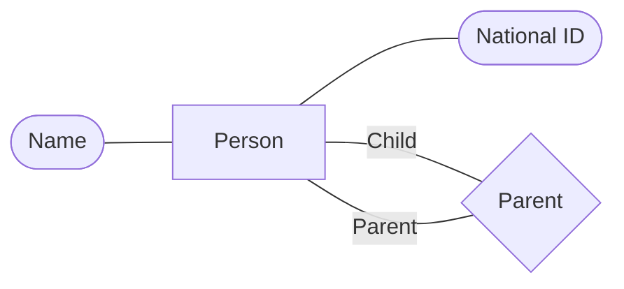
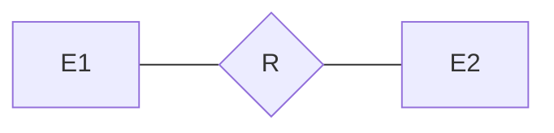
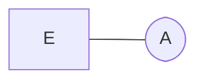
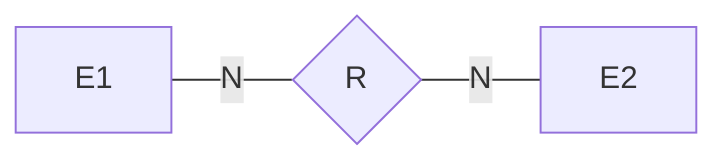
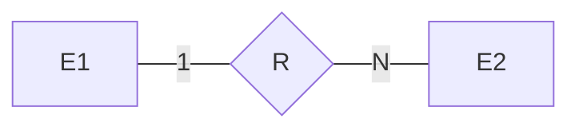
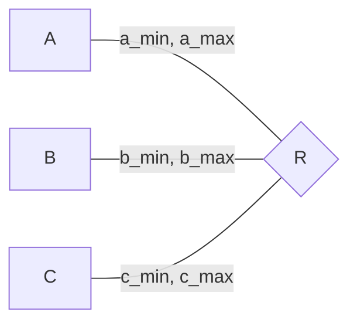
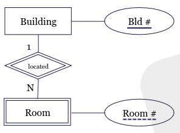
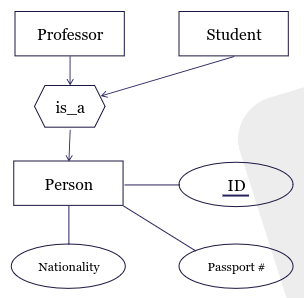

# Data Modelling and Databases Summary
Nicola Studer <[nicstuder@student.ethz.ch](mailto:nicstuder@student.ethz.ch)>,

All screenshots are directly taken from the lecture notes. All copyrights belong to the respective owners. Some mermaid graphs are made by the mighty [Cryptric](https://github.com/cryptric).

- [Data Modelling and Databases Summary](#data-modelling-and-databases-summary)
  - [Different types of databases](#different-types-of-databases)
    - [Hierarchial Model (IMS)](#hierarchial-model-ims)
    - [Network Model (Data Model)](#network-model-data-model)
    - [Relational Model](#relational-model)
  - [Relational Model](#relational-model-1)
    - [Relational Algebra](#relational-algebra)
    - [Relational Calculus](#relational-calculus)
      - [Semantics](#semantics)
    - [Domain Independent Relational Calculus](#domain-independent-relational-calculus)
    - [Conjunctive Query](#conjunctive-query)
    - [Bag Semantics](#bag-semantics)
  - [SQL](#sql)
    - [Data Definition Language (DDL)](#data-definition-language-ddl)
    - [Integrity Constraints](#integrity-constraints)
      - [REFERENTIAL constraints](#referential-constraints)
    - [Data Manipulation Language](#data-manipulation-language)
      - [Snapshot Semantics](#snapshot-semantics)
    - [Query language](#query-language)
      - [Recursive Queries](#recursive-queries)
    - [NULL and its semantics](#null-and-its-semantics)
      - [Commands that introduce NULL](#commands-that-introduce-null)
    - [Views](#views)
      - [Update Views](#update-views)
  - [Entity-Relationship Model](#entity-relationship-model)
    - [ER-Diagram](#er-diagram)
      - [Formal semantics](#formal-semantics)
      - [Cardinality](#cardinality)
      - [Extensions](#extensions)
      - [Principles](#principles)
    - [ER-Model to Relational Model](#er-model-to-relational-model)


## Different types of databases
**Database**: Collection of data / facts.

**Database Management System (DBMS)**: Software designed to assist in maintaining and utilizing large collections of data. It should have the following properties:
- **Data Independence**: Application should not know how data are stored.
- **Efficient Data Access**: The system should be able to store and retrieve data efficiently, without users worrying about it (too much)
- **Transactional Access**: As if there is only a single user using a system that does not fail
- **Generic Abstraction**: Users do not need to worry about all the above issues fo each new query.

### Hierarchial Model (IMS)
Database schema is a hierarchy (tree) of record types, which are tuples. A query essentially traverses the tree one record-at-a-time.

Problems:
- Too restrictive because of tree structure
- Do not provide (physical) data Independency
- Require manual query optimization

### Network Model (Data Model)
Database schema is a network of record types. A query traverses the network (graph) one record-at-a-time.

Problems:
- Do not provide (physical) data independency.
- Require manual query optimization.

### Relational Model
Database schema is composed as a set of relations, which are sets of tuples of the same type. A query is a set operation over relations with one set-at-a-time.

## Relational Model
Represent knowledge as a collection of facts, and doing inference using *mathematical logic*.

**Database Schema**: A Set of Relation Schemas

**Relation Schema**: $R(f_1: D_1, \ldots, f_n: D_n)$

**Instance**: $I_R \subseteq D_1 \times \ldots \times D_n$, content of the "relation".

**Candidate Key**: Minimal set of fields that identify each tuple uniquely.

**Primary Key**: One candidate key; marked in Schema by underlining.

**Valid Instances**: $R(\underline{k: D_k}, a: D_a, b:D_b): I \subseteq D_k \times D_a \times D_b \land \forall (k, a, b), (k', a', b') \in I, k = k' \implies (a, b) = (a', b')$.

> In general every relation must have a key.

### Relational Algebra

**Query**: Is a function that takes as input a DB instance, output a new relation.

**Query Language**: Consists of a set of functions that you can express in that language.

| Symbol | Name | Definition |
| --- | --- | --- |
| $\cup$ | Union | $x \in R_1 \cup r_1 \iff x \in R_1 \land x \in R_2$ |
| $-$ | Difference | $x \in r_1 - R_2 \iff x \in R_1 \land \not(x \in R_2)$ |
| $\cap$ | Intersection | $R_1 \cap R_2 = R_1 - (R_1 - R_2)$ |
| $\sigma$ | Selection | $\sigma_c(R) \iff x \in R \land c(x) = \text{True}$ |
| $\Pi$ | Projection | $\Pi_{A_1, \ldots A_n}(R)$ (keep subset of columns)|
| $\times$ | Cartesian Product | $(x, y) \in R_1 \times R_2 \iff x \in R_1 \land y \in R_2$ |
| $\rho$ | Renaming | $\rho_{B_1, \ldots, B_n}(R)$ (change name of attributes)|
| $\bowtie$ | Natural Join | $R_1(A, b) \bowtie R_2(B, C) = \Pi_{A, B, C}(\sigma_{R_1.B = R_2.B}(R_1 \times R_2))$ |
| | | $R(A, B, C) \bowtie S(D, E) \iff R \times S$ |
| | | $R(A, B, C) \bowtie S(A, B, C) \iff R \cup S$ |
| $\bowtie_\theta$ | Theta Join | $R_1 \bowtie_\theta R_2 = \sigma_\theta(R_1 \times R_2)$ |
| $\bowtie_{A = B}$ | Equi-Join | $R_1 \bowtie_{A = B} R_2 = \sigma_{A = B}(R_1 \times R_2)$ |
| $\div$ | Relational Division | $R \div S = \Pi_{R-S} R - \Pi_{R-S}((\Pi_{R-S}R) \times S - R)$ (find all $k_1$, which have an instance with all of $k_2$) |
| $\ltimes_C$ | Semi-Join | $R_1(A_1, \ldots, A_n) \ltimes_c R_2(B-1, \ldots, B_m) = \Pi_{A_1, \ldots A_n}(R_1 \bowtie_c R_2)$ |

We have some further consequences: $R \bowtie S = (R \ltimes \Pi_B S) \bowtie S$.

One can compose multiple operations together to form a relational algebra expression.

### Relational Calculus
Relations are **facts**, let's query it with **logic**. Relational Calculus thus is a query language, which tells the system WHAT we want, instead of HOW to get it.

**New operations**:
| Symbol | Definition |
| --- | --- |
| $\delta$ | Duplication elimination |
| $\pi$ | Sorting |
| $\gamma$ | Group-and-aggregation |

**Database Schema**: $S = (R_1, \dots, R_m)$  where $R_i$ is a relation.

**Relation Schema**: $R(A_1: D_1, \ldots, A_n: D_n)$

**Domain**: $\text{dom} = \bigcup_i D_i$ infinite set of constants.

**Instance of Relation**: $R(A_1: d_1, \ldots, A_n: D_n): I_R \subseteq \text{dom}^n$ and $I_R$ is a finite set of facts over the relation.

**Instance of Database schema**: $S(R_1, \ldots R_m): \mathbb{I}$ a function that maps $R_i$ to an instance of $R_i$. Is a finite set of facts over all relations.

#### Semantics
Let $\phi$ be a first-order logic formula with free variables $x_1, \ldots, x_k$. Then $Q_\phi = \{(x_1, \ldots, x_n) \mid \phi\}$ is a domain relational calculus query.
- Each **relation** $R$ corresponds to a **predicate** $R$ in $\phi$
- Each **instance** $\mathbb{I}$ corresponds to a **first-order interpretation** $\mathbb{I}$
- An **assignment** is a mapping $\alpha: var \to \text{dom}$.
- The answer of $Q$ over $\mathbb{I}$ is $Q(\mathbb{I}) = \{(\alpha(x_1), \ldots, \alpha(x_k)) \mid \mathbb{I}, \alpha \vDash \phi\}$

> The answer of a relational calculus query does **not have to be finite** (e.g. $Q_\phi = \{(x_1, \ldots, x_k) \mid \lnot R(x_1, \ldots, x_n)\}$) for instance $\mathbb{I} = \{\}$.

We save a $Q_\phi$ is **safe** if $\forall \mathbb{I}: Q_\phi(\mathbb{I})$ is finite.

### Domain Independent Relational Calculus
A query where the answer depends not only on the interpretation of the relations, but also on the domain is called **domain dependent**.

We introduce some new definitions:
- **Active domain**: $adom(Q_\phi, \mathbb{I}) =$ all constants in $Q_\phi$ and $\mathbb{I}$.
- **Active Domain Semantics** for $Q_\phi$:
  - $Q_{adom(\phi, \mathbb{I})} = \{(x_1, \ldots, x_n) \mid \phi \land \forall i, x_i \in adom(\phi, \mathbb{I})\}$
  - Also all quantifier $\forall v_1, \exists v_1$ in $\phi$ becomes $\forall v_i \in adom(\phi, \mathbb{I}), \exists v_i \in adom(\phi, \mathbb{I})$.

Thus relational calculus under Active Domain Semantics always return finite answer.

**Codd's Theorem**: Domain-independent RC is a powerful as RA.

In databases the user writes RC, where the system then automatically find the best RA and because of Codd's theorem, this is always possible.

### Conjunctive Query
We still have two major problems with DI-RC:
1. Given a DI-RC query $\phi$, does there exist a DB instance such that it outputs non-empty answers? **Satisfiability - Undecidable**.
2. Given two DI-RC queries $\phi_1, \phi_2$, are they equivalent under all possible instances? **Equivalence - Undecidable**.

**Conjunctive Query** is an extension, such that these problems can be easier solved.
$\phi = \exists y_1, \ldots, y_l(A_1 \land \ldots \land A_m)$, with $Q_\phi = \{(x_1, \ldots, x_n) \mid \phi\}$ where each $A_j$ is an atom (= 1 predicate).

**SPJR Algebra**: RA with only **Selection, Projection, Join** and **Renaming** 

> CQ is as expressive as SPJR Algebra.

Furthermore we have the property, that CQ is monotonic: $\mathbb{I}_1 \subseteq \mathbb{I}_2 \implies Q(\mathbb{I}_1) \subseteq Q(\mathbb{I}_2)$.

### Bag Semantics
Real databases uses Bag semantics instead of set semantics, where a bag can have duplicate tuples in the same relation. SQL relations all have BAG semantics. In our definition each relational model is a set.

**Examples**:
- Bag Union: $\{1, 2, 1\} \cup \{1, 2, 3\} = \{1, 1, 1, 2, 2, 3\}$.
- Bad Difference: $\{1, 2, 1\} - \{1, 2, 3, 3\} = \{1\}$

## SQL
SQL is a family of standards:
- Data definition language (DDL)
- Data manipulation language (DML)
- Query Language

### Data Definition Language (DDL)
Provides statements to defined the schema.

```sql
-- creation
CREATE TABLE Professor(
  PersNr integer,
  Name varchar (30),
  Level character(2) default 'AP',
  PRIMARY KEY (PersNr)
);

-- deletion
DROP TABLE Professor;

-- Modify table
ALTER TABLE Professor ADD COLUMN (age
integer);

ALTER TABLE Professor DROP COLUMN age;
```

### Integrity Constraints
Define the set of *valid DB* instances.The DB makes sure changes are consistent and do not cause troubles later on, thus controlling the content of the data and its consistency as part of the schema.

**PRIMARY KEY constraint**: A certain attribute needs to be *unique* and *not NULL*. We can define PRIMARY KEY over multiple attributes, but only one per relation.
```sql
CREATE TABLE tbl1 (
  field1 int,
  field2 int,
  field3 int,
  PRIMARY KEY (field2, field3)
);
```

**UNIQUE constraint**: A certain attribute needs to be unique. It is different from Primary Key as it can be NULL. Furthermore it can span multiple columns.
```sql
CREATE TABLE tbl1 (
  field1 int UNIQUE,
  field2 int,
  field3 int,
  UNIQUE (field1, field2)
);
```

**CHECK constraint**: Conduct local checking of the value of attributes (local in the sense that you take as input a tuple and check whether it satisfies some constraints).
```sql
CREATE TABLE tbl1 (
  field1 int,
  field2 int,
  field3 itn,
  check(field1 >= 4 AND field2 < 5)
);
```

> If the condition in the check results in `Unknown`, it accepts **all** inputs.

#### REFERENTIAL constraints

**Foreign Keys**: Refer to tuple from a different relation. For every foreign key one of the following two conditions must hold:
1. The value of the foreign key is `NULL`
2. The referenced tuple must exist

```sql
CREATE TABLE tbl1 (
  id int primary key,
  foreign_field int REFERENCES tbl2.field
);
```

There are many more maintenance constraints:
- **Cascade**: Propagate update or delete
- **Restrict**: Prevent deletion of the primary key before trying to do the change, cause error
- **No Action**: Prevent modifications after attempting the change, cause an error
- **Set default, set null**: Set references to NULL or to a default value

```sql
CREATE TABLE tbl1 (
  id int primary key,
  foreign_field int REFERENCES tbl2.field ON DELETE {cascade |restrict | no action | set null | set default}
)
```

### Data Manipulation Language
How can we modify/add/delete data in our database. This should be learned with practice, not this theory. Thus this chapter is really short without much explanation.

```sql
-- inserts
INSERT INTO Student (PersNr, Name)
VALUES (28121, `Frey`)

-- delete
DELETE Student
WHERE Semester > 13;

-- update
UPDATE Student
SET Semester = Semester + 1;
```

(**ETL**) Automatic tools are used to
- **Extract**: get data from some file
- **Transform**: apply transformation to the data when needed
- **Load**: insert into the DB as a bulk operation

```sql
INSERT INTO Professor VALUES (2125, ‘John’, ‘AP’, 226);
INSERT INTO Professor VALUES (2126, ‘David’, ‘FP’, 232);
INSERT INTO Professor VALUES (2127, ‘Anna’, ‘FP’, 310);

--bulk load
COPY Professor FROM ‘/profs.csv’ WITH FORMAT csv;
```

#### Snapshot Semantics
When we have an update on the relation where the condition is dependent on the data of the same relation, SQL goes trough two phases:
1. *Mark* all tuples which are affected by the updates.
2. *Implement*  updates on the marked tuples.

### Query language
Every RA expression can be written in a subset of SQL:

| Function | Example | SQL |
| --- | --- | --- |
| $\cup$ | $R_1 \cup R_2$ | `(SQL 1) UNION (SQL 2)` |
| $-$ |$R_1 - R_2$ | `(SQL 1) EXCEPT (SQL 2)` |
| $\sigma$ | $\sigma_C(R)$ | `SELECT * FROM (SQL 1) WHERE c;` |
| $\Pi$ | $\sigma_C(R)$ | `SELECT * FROM (SQL1) WHERE c;` |
| $\times$ | $R_1 \times R_2$ | `SELECT * FROM (SQL 1), (SQL 2);` |
| $\rho$ | $\rho_{a, b, c}R$ | `SELECT A as a, ..., C as c FROM (SQL 1)` |

Some further examples:
```sql
-- sorting
SELECT PersNr, Name, Level
FROM Professor
ORDER BY Level DESC, Name DESC;

-- Grouping, Aggregation
SELECT Level, COUNT(*)
FROM Professor
GROUP BY Level;

-- Filter groups with conditions
SELECT p.PersNr, Name, sum (CP)
FROM Lecture l, Professor p
WHERE l.ProfNr= p.PersNr and level =  ́FP ́
GROUP BY p.PersNr, Name
HAVING avg (CP) >= 3;

-- Existential Quantification (uncorrelated subquery)
SELECT p.Name
FROM Professor p
WHERE p.PersNr NOT IN
(SELECT PersNr FROM Lecture);

-- Existential Quantification (correlated subquery)
SELECT p.Name
FROM Professor p
WHERE NOT EXISTS (SELECT *
FROM Lecture l
WHERE l.PersNr = p.PersNr);
```

#### Recursive Queries
SQL provides an easy way to express recursion inside queries. The basic notation look like:
```sql
WITH RECURSIVE R AS ('base query' UNION 'RECURSIVE QUERY')
<Query involving R and other tables>
```

The `base query` is really the base case, which can be run in the table without the recursion!

To execute it SQL has the following algorithm:
1. Set `R = Empty`
2. Run (`base query UNION recursive query`) and set it as the new `R`.
3. Repeat until `R` does not change.

An example could look like:
```sql
WITH RECURSIVE AncestorOfD(ancester) AS -- Recursive Relation AncestorOfD with Attribute ancester
(SELECT parent FROM ParentOf WHERE child = D -- base case
 UNION
 SELECT p2.parent FROM AncestorofD p1, ParentOf p2 WHERE p1.ancester = p2.child) -- Recursive Query
SELECT * FROM AncesterOfD; -- The query
```

As SQL implements first-order logic it is thus not able to express the transitive closure.
Thus we have to be sure that AncestorOfD eventually will not change anymore, or else the Query will not terminate.

### NULL and its semantics
First of all: **NULL is a state, not a value**. NULL means "I don't know", which means that it could take any value in the domain. The DB is conservative when it tries to give you an answer.

**Arithmetics**:
- `(NULL + 1) -> NULL`
- `(NULL * 0) -> NULL`

**Comparisons**:
- `(NULL = NULL) -> Unknown`
- `(NULL < 13) -> Unknown`
- `(NULL > NULL) -> Unknown`

**3-value Logic**:
| not | |
|---------|---------|
| true | false |
| unknown | unknown |
| false | true |

| and | true | unknown | false |
|---------|---------|---------|-------|
| **true** | true | unknown | false |
| **unknown** | unknown | unknown | false |
| **false** | false | false | false |

| or | true | unknown | false |
|---------|------|---------|---------|
| **true** | true | true | true |
| **unknown** | true | unknown | unknown |
| **false** | true | unknown | false |

**Extras**:
- `(NULL = NULL) -> Unknown`
- `(NULL IS NULL) -> True`
- `NULL` in Group By: All NULLs form a single group
- `NULL` in values: Most operators will ignore the NULL value (e.g. `COUNT(*)` will not ignore NULL, but `COUNT(FIELD)` will ignore it)
- `NULL` in values: When there is nothing $\to$ NULL.

#### Commands that introduce NULL
- **Left Outer Join**: Keep unmatched tuple on the left and fill the missing values with `NULL`.
- **Right Outer Join**: Keep unmatched tuple on the right and fill the missing values with `NULL`.
- **Outer Join**: Keep unmatched tuple on both the left and the right and fill the missing values with `NULL`.

### Views
Where as **relation** is a powerful abstraction that provides us *physical data independence*, a **view** aims to raising the level of abstraction even higher and provides us with *logical data independence*.

A view is the result set of a stored query on the data, which the database users can query just as they would in a persistent database collection object.

```sql
CREATE VIEW FlightFromPEK AS
SELECT * FROM Flight WHERE orig=PEK;
```

Logically, the table `FlightFromPEK` has never been materialized.

Views have many different applications:
- **Privacy**: View can be used for access control and preserving privacy.
- **Usability**: View can be used to make writing of some queries easier.
- **Generalization**: View can be used to implement generalization.

#### Update Views
SQL tries to avoid indeterminism and thus is conservative with respect to view updates. A SQ views is updatable iff:
1. The view involves only **one** base relation
2. The view involves the key of that base relation
3. The view does **not** involve aggregates, group by, or duplicate-elimination.

Keep unmatched tuple on the left and fill the missing values with `NULL`

## Entity-Relationship Model
An Entity-Relationship Model models an application into **Entity sets, Attributes** and **Relationships**.

**Entity sets**: A set of similar entities. Models an object in the real word that is distinguishable from other objects. Entities of an entity set share the same **attributes**.

**Relationships**: Connections among two or more entity sets.

### ER-Diagram
Is a graphical way of representing entities and the relationships among them.

Not all attributes are the same. Some attributes form a **key**, which is a minimal set of attributes whose values uniquely identify an entity in the set. There might be multiple keys, which are called **Candidate Keys**, but only one is called **Primary Key**, which is underlined in the ERD. Each entity must have a primary key.

**Role**: Role in the relationship.



ER-Diagram is a constraint language, defining the set of **Valid DB** instances.

#### Formal semantics
We define all values we can take by $\mathcal{D} = \mathcal{B} \cup \Delta$, where $\mathcal{B}$ is the set of concrete values (int, string, floating point, etc.) and $\Delta$ defines the abstract values (corresponding to the entity).

**Entity set** $E$: 1-ary Predicate $E(x)$. ($E(x) =$ True if $x$ is of Entity Type E).

**Attribute** $A$: binary Predicate $A(x, y)$. ($A(x, y) =$ True if $x$ has attribute $y$)

**n-ary Relation** $R$: n-ary Predicate $R(x_1, \ldots, x_n)$. ($R(x_1, \ldots, x_n) =$ True if $(x_1, \ldots, x_n)$ participate in R)

A first order interpretation $\mathcal{J}$ satisfies:
- $E^\mathcal{j} \subseteq \Delta$
- $A^\mathcal{j} \subseteq \Delta \times \mathcal{B}$
- $R^\mathcal{j} \subseteq \Delta^n$

Thus each subgraph introduces a first-order logic sentence. For example

is equivalent to $\forall x_1 \in \Delta, x_2 \in \Delta. R(x_1, x_2) \implies E_1(x_1) \land E_2(x_2)$.




is equivalent to $\forall x, E(x) \implies \exists^{=1}y. a(x, y) \land y \in \mathcal{B}.$ where $\exists^{=1}$ stands for uniquely exists.

#### Cardinality

**Many-to-many**: An entity of type E1 can have multiple relationships with entity of type E2.



**One-to-many**: An entity of type E1 can only be in relation with 1 entity of type E2.

which specifies a new constraint in first-order logic: $\forall x_{E1}, x_2. R(x_{E1}, x_{E2}) \implies \lnot \exists x_{E1}'. R(x_{E1}', x_{E2}) \land x_{E1}' \neq x_{E2}$. Thus in general if there are more entity sets involved in the relation the 1 in front of E1 that there is one E1 for each set of the other entities.

Furthermore we can have another notation describing the same thing but with a (min/max) approach which is more expressive:

Which specifies the following constraints:
- $\forall x_A. A(x_A) \implies \exists^{\geq a_{min}, \leq a_{max}}x_B', x_C'. r(x_A, x_B', x_C')$
- $\forall x_B. B(x_B) \implies \exists^{\geq b_{min}, \leq b_{max}}x_A', x_C'. r(x_A', x_B, x_C')$
- $\forall x_C. C(x_C) \implies \exists^{\geq c_{min}, \leq c_{max}}x_A', x_B'. r(x_A', x_B', x_C)$

with $\exists^{\geq c_{min}, \leq c_{max}}$ uniquely exists at least $c_{min}$ and at most $c_{max}$ instances.

#### Extensions
**Weak Entities**: Some entities rely on other entities.



Here in this example Room is a weak entity relying on Building, where the key of Room is $(\underline{\text{Bld \#}}, \underline{\text{Room \#}})$. This also implies that there cannot be a room without a building.

**Generalization**: Enables us to represent the information that multiple entities are of type of another entity.



Here Professor and Student share Person's attributes as well as primary keys.

#### Principles
1. Reflect reality
2. Avoid redundancy
3. Keep it simple
4. No tricks to improve redundancy
5. Less entities is better
6. Concise, correct, complete, comprehensive

### ER-Model to Relational Model
- Entities become relations.
- Relationships become relations.
- Merge relations with the same key
- Generalization
- Weak Entities
- Entity sets become tables
- Attributes of entity set become attributes of the table

When modelling cardinalities one has to be aware that there might be multiple solutions. Furthermore sometimes some entities can be merged together, but it doesn't make sense always. Thus it is only possible to (semi-)-automatically generate a Relational Model from ER.
