# Parallel Programming Summary
Nicola Studer <[nicstuder@student.ethz.ch](mailto:nicstuder@student.ethz.ch)>,
Ilija Pejic <[ipejic@student.ethz.ch](mailto:ipejic@student.ethz.ch)>

All screenshots are directly taken from the lecture notes. All copyrights belong to the respective owners.

- [Parallel Programming Summary](#parallel-programming-summary)
  - [Java Threads](#java-threads)
    - [Start / Join](#start--join)
    - [Thread Exception Handling](#thread-exception-handling)
    - [Wait / Notify](#wait--notify)
    - [Synchronized / External Locks](#synchronized--external-locks)
  - [Parallelism (Hardware)](#parallelism-hardware)
    - [Vectorization](#vectorization)
    - [Instruction Level Parallelism](#instruction-level-parallelism)
    - [Pipelining](#pipelining)
  - [Concepts](#concepts)
    - [Timing Terminology](#timing-terminology)
    - [Amdahl's Law](#amdahls-law)
    - [Gustafson's Law](#gustafsons-law)
    - [Taskgraphs (Cilk Style)](#taskgraphs-cilk-style)
  - [Algorithms](#algorithms)
    - [Divide and Conquer (Fork/Join)](#divide-and-conquer-forkjoin)
      - [ForkJoin Framework](#forkjoin-framework)
    - [Parallel Patterns](#parallel-patterns)
      - [Reduction and Maps](#reduction-and-maps)
      - [Prefix](#prefix)
      - [Pack](#pack)
  - [High Level Races](#high-level-races)
    - [Reentrant locks (recursive lock)](#reentrant-locks-recursive-lock)
    - [Races](#races)
  - [Correctness of Parallel Programs](#correctness-of-parallel-programs)
  - [Guidelines for parallel Programming](#guidelines-for-parallel-programming)
  - [Data Races (Low Level Races / Memory reorderings)](#data-races-low-level-races--memory-reorderings)
    - [Memory Model (Java)](#memory-model-java)
    - [Program Order (PO)](#program-order-po)
    - [Synchronization Actions (SA)](#synchronization-actions-sa)
    - [Synchronization Order (SO)](#synchronization-order-so)
    - [Synchronized-With (SW)](#synchronized-with-sw)
    - [Happens-before (HB)](#happens-before-hb)
  - [Behind Locks (Mutual Exclusion)](#behind-locks-mutual-exclusion)
    - [Proof Notation for Locks](#proof-notation-for-locks)
      - [Events and precedence](#events-and-precedence)
      - [Intervals](#intervals)
      - [Registers](#registers)
        - [Atomic Registers](#atomic-registers)
        - [SWMR Register (Single Write Multiple Reader Register)](#swmr-register-single-write-multiple-reader-register)
    - [Deckers Algorithm for 2 processes](#deckers-algorithm-for-2-processes)
    - [Peterson Lock](#peterson-lock)
    - [Filter Lock](#filter-lock)
    - [Bakery Algorithm](#bakery-algorithm)
    - [Spinlocks in Java](#spinlocks-in-java)
      - [TAS Lock](#tas-lock)
      - [TATAS Lock](#tatas-lock)
      - [Lock with sequential Backoff](#lock-with-sequential-backoff)
    - [Deadlock and Livelocks](#deadlock-and-livelocks)
    - [State Diagram](#state-diagram)
    - [Semaphores](#semaphores)
      - [Semaphores without Spinning](#semaphores-without-spinning)
    - [Barries (Two-Phase Barrier)](#barries-two-phase-barrier)
    - [Monitors](#monitors)
    - [Java Interface Lock](#java-interface-lock)
    - [Producer / Consumer Pattern](#producer--consumer-pattern)
      - [Produced / Consumer circular queue](#produced--consumer-circular-queue)
      - [Producer / Consumer queue with monitor in Java](#producer--consumer-queue-with-monitor-in-java)
      - [Producer / Consumer with explicit Lock](#producer--consumer-with-explicit-lock)
      - [Producer / Consumer, Sleeping Barber Variant](#producer--consumer-sleeping-barber-variant)
    - [Reader/Writer lock](#readerwriter-lock)
    - [Lock Granularity](#lock-granularity)
      - [Coarse-grained locking](#coarse-grained-locking)
      - [Fine-grained locking (hand over hand locking)](#fine-grained-locking-hand-over-hand-locking)
      - [Optimistic synchronization (locking)](#optimistic-synchronization-locking)
      - [Lazy synchronization (locking)](#lazy-synchronization-locking)
      - [Lazy Skip Lists](#lazy-skip-lists)
    - [Disadvantages of locking](#disadvantages-of-locking)
  - [Programming without Locks](#programming-without-locks)
    - [TAS and CAS](#tas-and-cas)
    - [Non-blocking Stack](#non-blocking-stack)
    - [Markable References](#markable-references)
    - [Lock-free queues](#lock-free-queues)
    - [ABA Problem](#aba-problem)
      - [Pointer Tagging](#pointer-tagging)
      - [Hazard Pointers](#hazard-pointers)
  - [Concurrency Theory](#concurrency-theory)
    - [History](#history)
      - [Projections](#projections)
    - [Linearizability](#linearizability)
    - [Sequential Consistency](#sequential-consistency)
    - [Quiescent Consistency](#quiescent-consistency)
    - [Consensus (Wait-free)](#consensus-wait-free)
      - [Requirements](#requirements)
      - [Examples](#examples)
        - [Atomic registers](#atomic-registers-1)
        - [CAS](#cas)
        - [FIFO queue](#fifo-queue)
  - [Transactional Memory](#transactional-memory)
    - [Implementation](#implementation)
      - [STM Implementation (Using ScalaSTM)](#stm-implementation-using-scalastm)
      - [Clock-based STM](#clock-based-stm)
    - [Isolation Methods](#isolation-methods)
    - [Nestings](#nestings)
      - [Flattened Nesting](#flattened-nesting)
      - [Closed Nesting](#closed-nesting)
  - [Distributed Memory and Message Passing](#distributed-memory-and-message-passing)
    - [The Actor Model](#the-actor-model)
    - [Event Driven Programming Model](#event-driven-programming-model)
    - [Communicating Sequential Processes](#communicating-sequential-processes)
    - [Message Passing Interface (MPI)](#message-passing-interface-mpi)
      - [MPI Communicators](#mpi-communicators)
      - [MPI in Java](#mpi-in-java)
  - [Parallel Sorting](#parallel-sorting)
    - [Sorting Networks](#sorting-networks)
  - [Implications](#implications)
  - [Keywords](#keywords)

## Java Threads
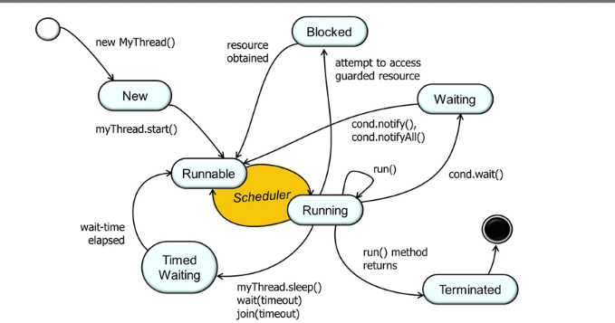
Multiple threads share the same address space. That means threads are not shielded from each other and share resources and can communicate more easily. The context switching between threads is efficient, because of the same address space and no automatic scheduling. No saving / reloading of PCB (OS process) state.

- Thread is created when an object derived from the Thread class is created. At this point, the thread is not executable, it is in a **new** state.
- Once the `start` method is called, the thread becomes eligible for execution by the scheduler.
- If the thread calls the `wait` method in an Object, or calls the `join` method in another thread object, the thread becomes **not runnable** and no longer eligible for execution.
- It becomes executable as a result of an associated `notify` method being called by another thread, or if the thread with which it has requested a join, becomes **terminated**.
- A thread enters the **terminated** state, either as a result of the run method exiting (normally, or as a result of an unhandled exception) or because its destroy method has been called.
- In the latter case, the thread is abruptly moved to the **terminated** state and does not have the opportunity to execute any finally clauses associated with its execution; it may leave other objects locked.

### Start / Join

- `t.start()`: Invokes `run()` on newly thread.
- `t.run()`: Runs the code in the same thread. It does not start a new thread.
- `t.getId()`: Get thread ID
- `Thread.currentThread()`: Returns current thread
- `t.setName()`: Set thread's name
- `t.setPriority(Thread.MAX_PRIORITY)`: Set priority level
- `t.getState()`: Returns the state of thread (e.g. `State.TERMINATED`)
- `t.join()`: Thread waits until `t` thread is has reached `TERMINATED` state.
- `t.sleep(time)`: Let a thread wait till `time` passes in ms.

A program ends when all thread (non-daemon threads) finish.

The old method to create a thread:
```java
class ConcurrWriter extends Thread {
    public void run() {
    // code here executes concurrently with caller
    }
}

ConcurrWriter writerThread = new ConcurrWriter();
writerThread.start();
```

The new method to create a thread:
```java
public class ConcurrWriter implements Runnable {
    public void run() {
    // code here executes concurrently with caller
    }
}

ConcurrReader readerThread = new ConcurrReader();
Thread t = new Thread(readerThread);
t.start();
```

Inline thread creation:
```java
new Thread() {
  public void run(){
    //code
  }
}.start();
```


### Thread Exception Handling
```java
public class ExceptionHandler implements UncaughtExceptionHandler {
    public Set<Thread> threads = new HashSet<>();
    
    @Override
    public void uncaughtException(Thread thread, Throwable throwable) {
        println("An exception has been captured");
        println(thread.getName());
        println(throwable.getMessage());
    .   ..
        threads.add(thread);
    }
}

public class Main {
    public static void main(String[] args) {
        ...
        ExceptionHandler handler = new ExceptionHandler();
        thread.setUncaughtExceptionHandler(handler);
        ...
        thread.join();
        if (handler.threads.contains(thread)) {
            // bad
        } else {
            // good
        }
    }
}
```

### Wait / Notify

May only be called when object is locked (e.g. inside `synchronized`): 
- `wait()`: releases object lock, thread waits on internal queue. Thead must own object's lock to call `wait`.
- `notify()`: wakes the highest-priority thread closest to front of object’s internal queue. Releases the monitor after execution of the synchronized block.
- `notifyAll()`: wakes up all waiting threads.

```java
// do not do this
if (condition) {
    obj.wait();
}

// do this instead
while (condition) {
    obj.wait();
}
```

### Synchronized / External Locks
Synchronization is built around an internal entity known as the intrinsic lock or monitor lock.

```java
// synchronized method: locks on "this" object
public synchronized type name(parameters) { ... }
// synchronized static method: locks on the given class
public static synchronized type name(parameters) { ... }

// synchronized block: uses the given object as a lock
synchronized (object) {
    statement(s); // critical sections
}

// Reentrancy of locks
public class Foo {
    public void synchronized f() { … }
    public void synchronized g() { … f(); … }
}

Foo foo = new Foo();
synchronized(foo) { … synchronized(foo) { … } … }
```
A synchronized method grabs the object or class's lock at the start, runs to completion, then releases the lock. Useful for methods whose entire bodies are critical sections, and thus should not be entered by multiple
threads at the same time.
> A synchronized method is a critical section with guaranteed mutual exclusion.

The advantage of not synchronizing the entire method is efficiency but need to be careful with correctness. 

> Disjoint locks allow for more concurrency.

Internally, the JVM implements synchronized by using native, operating system primitives (and low level architecture instructions, say Intel’s x86 e.g. compareand-swap, or IBM Power’s LL/SC). This means the implementation of synchronized will look different on different OS/architecture combinations.

## Parallelism (Hardware)
CPU reads/writes values from/to main memory, to compute with them with a hierarchy of memory caches in between.
Faster memory is more expensive, hence smaller: L1 is 5x faster than L2, which is 30x faster than main memory, which is 350x faster than disk.

Computations get faster on hardware level by **parallel execution** (i.e. additional execution units)

### Vectorization
Exposed to developers.
**SIMD** := Single Instruction (OP), applied to Multiple Data.

Assembler Pseudo Code (Hardware vectorinstructions)
```
r1 = VLOAD  a,  i, i+3
r2 = VLOAD  b,  i, i+3
r3 = VADD   r1, r2
VSTORE      c,  i, r3
```

**Automated Vectorization**: C/C++ (Not vectorized) $\to$ vectorized machine code
**Manual Vectorization**: C/C++ (using intrinsics) $\to$ vectorized machine code
**Atomated Vectorization**: Java Code $\to$ bytecode $\overset{\text{JIT}}{\to}$ vectorized machine code

### Instruction Level Parallelism
Inside CPU.

```
e = a + b // this and the one below are independent
f = c + d // can execute these 2 instructions in parallel
m = e * f // this one depends on results above, so has to wait
```
Independent, if:
- different register names
- different memory addresses

Enable ILP: Superscalar CPUs
- Multiple instructions per cycle / multiple functional units
Increase opportunities for ILP:
- Speculative execution
  - Predict results to continue execution
  - Branch prediction flow control spec
> 1. Jumps in memory $\to$ bad for caches
> 2. Jumps in code $\to$ bad for ILP
- Out-of-Order (OoO) execution
  - Potentially change execution order of instructions
  - As long as the programmer observes the sequential program order
- Pipelining

In Java ILP can be managed by using `synchronized(obj)` for memory barriers / fences.

### Pipelining
Also internal, but transfers to software.

- **Latency**: time needed to perform a given computation (e.g., process a customer)
$$l = \sum_{s \in \text{stages}} s$$
$$\text{latency bound} = \sharp\text{Stages} \cdot \max(\text{computationtime}(\text{stages}))$$
- **Throughput**: amount of work that can be done by a system in a given period of time(e.g., how many customers can be processed in one minute).
$$tp = \frac{1}{\max(\text{computationtime}(\text{stages}))}$$
- **Balanced/Unbalanced Pipeline**: a pipeline is balanced if it has constant latency. If the first computation step is the longest, the pipeline is always balanced.
> all stages require the same time $\implies$ balanced.
> balanced $\nRightarrow$ all stages require the same time

**Calculate the complete processing length**:
$$t_f = l + (n-1) \cdot \frac{1}{tp}$$

## Concepts
- **Work Partitioning**: Split up work of a single program into parallel tasks
- **Explicit Parallelism**: user explicitly expresses tasks/threads
- **Implicit Parallelism**: Done automatically by the system (e.g. in data parallelism). User expresses an operation and the system does the rest.
- **Scheduling**: Assign tasks to processors. 

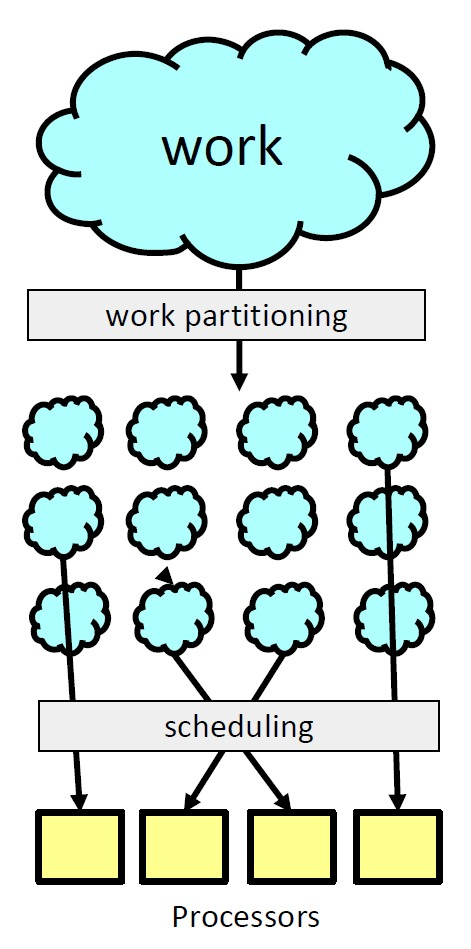

Different Task distributions:
- **Fine Granularity**: Many small tasks. Better for scheduling. If scheduling overhead is comparable to a single task $\to$ overhead dominates.
- **Coarse Granularity**: More bigger tasks.

### Timing Terminology
- $T_1$: Sequential execution time
- $T_p$: Execution time on $p$ CPUs
  - $T_p = T_1 / p$ (perfection)
  - $T_p > T_1 / p$ (performance loss, what normally happens)
  - $T_p < T_1 / p$ (sorcery!)
- $S_p$: Parallel speedup on $p$ CPUs. $S_p = T_1 / p$
  - $S_p = p \to$ Linear speedup (perfection)
  - $S_p < p \to$ sub-linear speedup (performance loss)
    - Programs may not contain enough parallelism
        – e.g., some parts of program might be sequential
    - overheads introduced by parallelization
        – typically associated with synchronization
    - architectural limitations
–        e.g., memory contention
  - $S_p > p \to$ super-linear speedup (sorcery)
- Efficiency (Relative speedup): $S_p / p$
- Parallelism: $T_1 / T_\infty$ (maximum possible speed-up)

### Amdahl's Law
Concerns maximum speedup. Architectural constrains will make factors worse. But his law is mostly bad news.

$T_1$ split into two categories:
- $W_{ser}$: Time spent doing non-parallelizable serial work
- $W_{par}$: Time spent doing parallelizable work.
- $T_1 = W_{ser} + W_{par}$
- $T_p \geq W_{ser} + \frac{W_{par}}{p}$

Hence the formula of Amdahl's law:
$$S_p \leq \frac{W_{ser} + W_{par}}{W_{ser} + \frac{W_{par}}{p}}$$

Thus when calculating with $f$ as non-paralelizable serial fractions of the total work, then the following equation holds for $W_{ser} = f T_1$ and $W_{par} = (1 - f) T_1$:
$$S_p = \frac{1}{f + \frac{1 - f}{p}}$$

With infinite workers:
$$S_\infty \leq \frac{1}{f}$$

### Gustafson's Law
$$W = p(1 - f)T_{wall} + f T_{wall}$$
$$S_p = f + p(1 - f) = p - f(p - 1)$$

### Taskgraphs (Cilk Style)
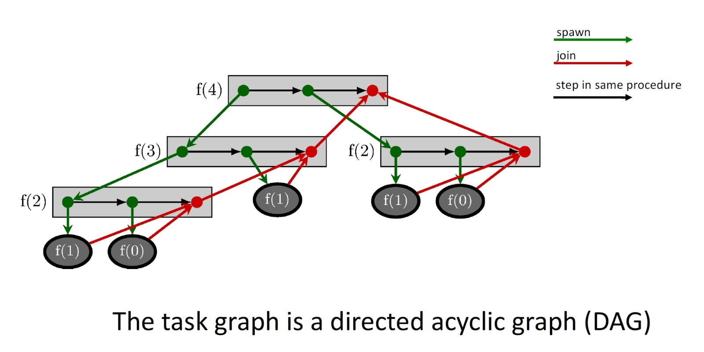
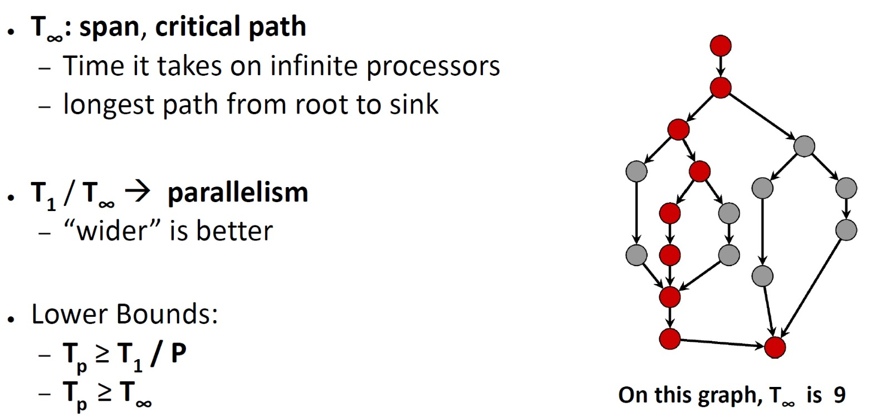

## Algorithms

### Divide and Conquer (Fork/Join)
Also called recursive splitting. Split work into smaller, independent tasks and solve recursively.

The key is divide-and-conquer parallelizes the result-combining
- If you have enough processors, total time is height of the tree: $\mathcal{O}(\log n)$ (optimal, exponentially faster than sequential $\mathcal{O}(n))$
- Often relies on operations being associative (like $+$)

```
Divide and Conquer:
    if cannot divide:
        return unitary solution (stop recursion)
    divide problem in two
    solve first (recursively)
    solve second (recursively)
    combine solutions
    return result
```

Example of divide and conquer in java:
```java
public void run(){
    int size = h-l;
    if (size == 1) {
        result = xs[l];
        return;
    }
    int mid = size / 2;
    SumThread t1 = new SumThread(xs, l, l + mid);
    SumThread t2 = new SumThread(xs, l + mid, h);
    t1.start();
    t2.run();
    t1.join();
    result = t1.result + t2.result;
    return;
}
```

> Using one thread per (small tasks) is highly inefficient. And too many threads can cause an error. `Java.lang.OutOfMemoryError`: unable to create new native thread

We can use a sequential cutoff (around 500-1000) to eliminate many creations of small threads. Same by running the second thread on the current thread instead of creating a second thread.

Executor Service in Java:
```java
int ntasks = 1000;
ExecutorService exs = Executors.newFixedThreadPool(4);
for (int i=0; i<ntasks; i++) {
    HelloTask t = new HelloTask("Hello from task " + i); // implements runnable
    exs.submit(t);
}
exs.shutdown(); // initiate shutdown, does not wait, but can’t submit more tasks
```

#### ForkJoin Framework
`Thread` $\to$ `RecursiveTask<V>`
`run` $\to$ `compute`
`start` $\to$ `fork`
`join` $\to$ `join` with return value
Don't call `run` to hand-optimize $\to$ Do call `compute` to hand-optimize
Don't have a topmost call to `run` $\to$ Do create a pool and `invoke`
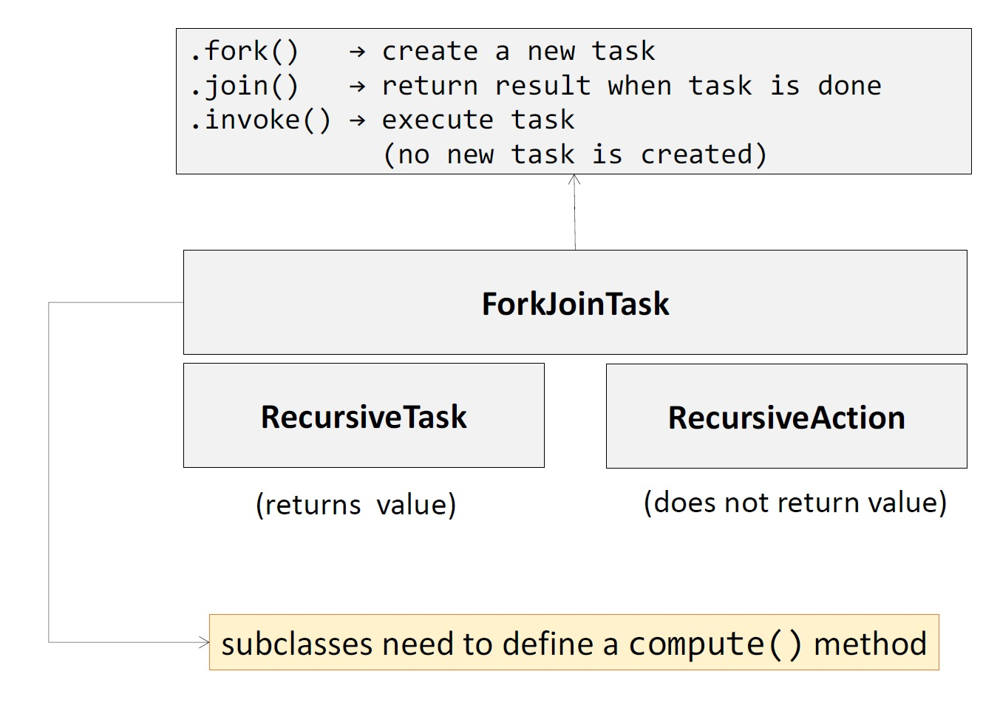

- Sequential threshold
- Library needs to "warm up"
- Beware memory-hierarchy issues

### Parallel Patterns
#### Reduction and Maps
Produce single answer from collection via an associative operator: `max`, `count`, `rightmost`, `sum`, etc.
Non-examples: `median`, `subtraction`, `exponentiation`

A map operates on each element of a collection independently to
create a new collection of the same size
- No combining results
- For arrays, this is so trivial some hardware has direct support

So an symptotically optimal execution would be:
$$T_p = \mathcal{O}((T_1 / p) + T_\infty)$$
> First term dominates for small $p$, second for large $p$.

#### Prefix
The parallel-prefix algorithm does two passes
- Each pass has $\mathcal{O}(n)$ work and $\mathcal{O}(\log n)$ span
- So in total there is $\mathcal{O}(n)$ work and $\mathcal{O}(\log n)$ span
- So like with array summing, parallelism is $n/\log n$
First pass builds a tree bottom-up: the “up” pass
Second pass traverses the tree top-down: the “down” pass

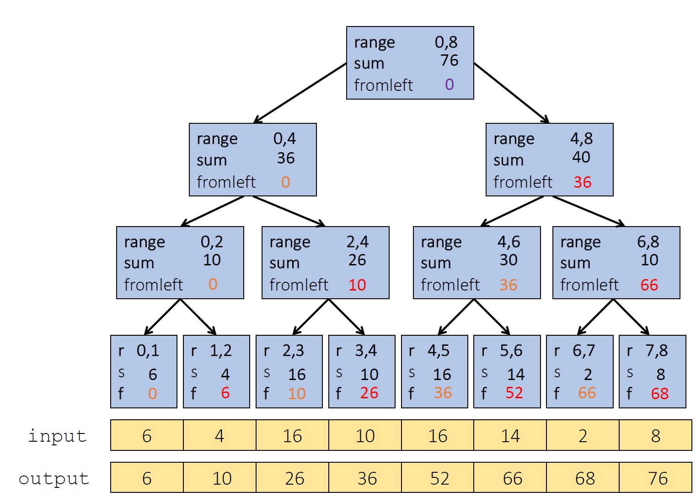

#### Pack
Given an array `input`, produce an array `output` containing only elements such that `f(elt)` is `true`.

First two steps can be combined into one pass
- Just using a different base case for the prefix sum
- No effect on asymptotic complexity

Can also combine third step into the down pass of the prefix sum
- Again no effect on asymptotic complexity

Analysis: $\mathcal{O}(n)$ work, $\mathcal{O}(\log n)$ span
- 2 or 3 passes, but 3 is a constant

## High Level Races
**immutability**
– data do not change
– best option, should be used when possible
**isolated mutability**
– data can change, but only one thread/task can access them
**mutable/shared data**
– data can change / all tasks/threads can potentially access them

**Dealing with mutable/shared state**:
- locks: mechanism to ensure exclusive access/atomicity
    – ensuring good performance / correctness with locks can be hard (especially for “programming in the large”)
- Transactional memory: programmer describes a set of actions that need to be atomic
    – easier for the programmer, but getting good performance might be challenging

Lock Methods (all atomic):
- `new`: make new lock, initially "not held"
- `acquire`: blocks if this lock is already currently "held"
- `release`: make this lock "not held"

> These methods use special hardware and OS support. 

```java
public interface lock {
    public void lock();
    public void unlock();
}
```

### Reentrant locks (recursive lock)
When the lock goes from not-held to held, the count is set to 0
If (code running in) the current holder calls `lock(acquire)`:
- it does not block
- it increments the count
On `unlock(release)`:
- if the count is > 0, the count is decremented
- if the count is 0, the lock becomes not-held

> One has to release the lock the number of times it get locked in the recursion.

> Java `synchronized` is reentrant.

### Races
Race condition occurs when the computation result depends on the scheduling (how threads are intearleaved).

**Data Race** [aka Low Level Race Condition, low semantic level]
Erroneous program behavior caused by insufficiently synchronized accesses of a shared resource by multiple threads, e.g. Simultaneous read/write or write/write of the same memory locatio
> (for mortals) always an error, due to compiler & HW

**Bad Interleaving** [aka High Level Race Condition, high semantic level]
Erroneous program behavior caused by an unfavorable execution order of a multithreaded algorithm that makes use of otherwise well synchronized resources.
> “Bad” depends on your specification

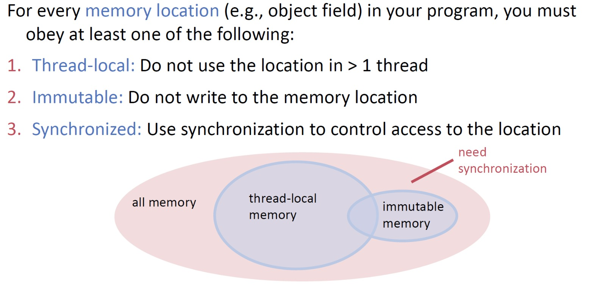

## Correctness of Parallel Programs
- absence of data races
- mutual exclusion
- linearizability
- atomicity
- schedule-deterministic
- absence of deadlock
- custom invariants (e.g., age > 15)

> **Concurrency**: Dealing with multiple things at the same time
> **Parallelism**: doing multiple things at the same time

## Guidelines for parallel Programming
1. No Data Races
> Never allow two threads to read/write or write/write the same location at the same time. Do not make any assumptions on the orders of reads or writes.
2. For each location needing synchronization, have a lock that is always held when reading or writing the location
> We say the lock guards the location
> The same lock can (and often should) guard multiple locations
> Clearly document the guard for each location
3. Lock Granularity
   1. **Coarse-grained**: Fewer locks, i.e. more objects per lock. Easier to implement. Faster/easier to implement operations that access multiple locations. Much easier: operations that modify data-structure shape.
   2. **Fine-grained**: More locks, i.e., fewer objects per lock. More simultaneous access.
4. Start with coarse-grained (simpler) and move to fine-grained (performance) only if contention on the coarser locks becomes an issue. Alas, often leads to bugs.
5. Do not do expensive computations or I/O in critical sections, but also don’t introduce race conditions
6. Think in terms of what operations need to be atomic
   1. Make critical sections just long enough to preserve atomicity
   2. Then design the locking protocol to implement the critical sections correctly

## Data Races (Low Level Races / Memory reorderings)
**Rule of thumb:** Compiler and hardware allowed to make changes that do not affect the semantics of a sequentially executed program.

**Software View**: Modern compilers do not give guarantees that a global ordering of memory accesses is provided.

**Hardware View**: Modern multiprocessors do not enforce global ordering of all instructions.

### Memory Model (Java)
Contract between programmer, compiler, architecture about semantics. Memory models can be described with actions and different orderings:
- Program Order
- Synchronization Actions
- Synchronized-With
- Synchronization Order
- Happens-before

### Program Order (PO)
- Program order is a total order of intra-thread actions
- Program order does not provide an ordering guarantee for memory accesses
- The PO is consistent with the thread's isolate execution
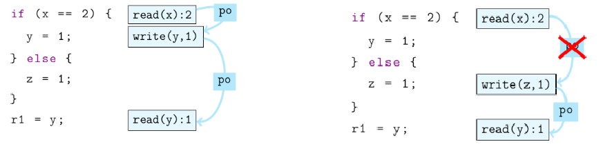

### Synchronization Actions (SA)
- Read\write of a volatile variable
- Lock monitor, unlock monitor
- First/Last action of a thread
- Actions which start a thread
- Actions which determine if a thread has terminated

### Synchronization Order (SO)
- Total Order
- All threads see SA in the same order
- SA withing a thread are in PO
- SO is consistent: all reads in SO see the last writes in SO

### Synchronized-With (SW)
- Pairs the specific actions which "see" each other
- A volatile write to x synchronizes with subsequent read of x (subsequent in SO)

### Happens-before (HB)
- Transitive close of PO and SW
- HB consistency: When reading a variable, wee see either the last write (in HB) or any other unordered write. (Races are allowed!)

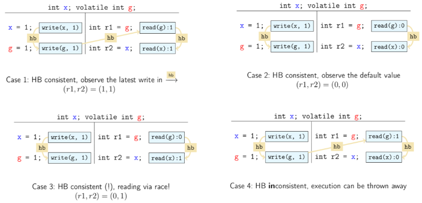

## Behind Locks (Mutual Exclusion)
Critical Section:
- Mutual exclusion: Statements from critical sections of two or more processes must not be interleaved
- Freedom from deadlock: One process in the critical section must eventually succeed
- Freedom from starvation: If any process tries to enter its critical section, then that process must eventually succeed

> Theorem 5.1: If S is a [atomic] read/writes system with at least two processes and S solves mutual exclusion with global progress [deadlock-freedom], then S must have at least as many variables a processes.

The following algorithms are not used for mutual exclusion
- space lower bound linear in the number of maximum threads
- without volatile variables the assumption on memory reordering does not hold. Memory barriers in hardware are expensive
- modern multiprocessor architectures provide special instructions for atomically reading and writing at once

### Proof Notation for Locks
#### Events and precedence
**Events**: Thread produces sequence of events $p_0, p_1, \ldots$.
$$
p_1 = "\text{flag}[P] = \text{true}"
$$

**$j$-th occurence of event $i$ in thread $P$**: $p_i^j$

**Precedence relation**: $a \to b \iff$ $a$ occurs before $b$

#### Intervals
$I_A = (a_0, a_1)$: interval of events $a_0$, $a_1$ with $a_0 \to a_1$

**Precedence relation**: $a_1 \to b_0 \implies I_A \to I_B$

Intervals can be either interleaved (that means two intervals are concurrent) or disjoint.

#### Registers
##### Atomic Registers
**Operations**: `r.read()` / `r.write(v)`
**Invocation**: $J$ of `r.read` or `r.write` takes effect at a single point $\theta(J)$
**Safe**: Two operations on the same register always have a different effect time

##### SWMR Register (Single Write Multiple Reader Register)
**Operations**: `r.read()` / `r.write(v)`
**Properties**: Only one concurrent write, but multiple concurrent reads allowed
**Safe**: Any read not concurrent with a write returns the current value of `r`. Any read concurrent with a write can return **any** value of the domain of `r`.

### Deckers Algorithm for 2 processes
```
volatile boolean wantp = false;
volatile boolean wantq = false;
integer turn = 1;

Process P                     |  Process Q
loop                          |  loop
  non-critical section        |    non-critical section
  wantp = true                |    wantq = true
  while(wantq) {              |    while(wantp) {
    if (turn == 2) {          |      if (turn == 1) {
      wantp = false;          |        wantq = false;
      while(turn != 1) {}     |        while(turn != 2) {}
      wantp = true;           |        wantq = true;
    }                         |      }
  }                           |    }
  critical section            |    critical section
  turn = 2;                   |    turn = 1;
  wantp = false;              |    wantq = false;
```

### Peterson Lock
```
int P = 1;
int Q = 1;
volatile boolean array flag[2] = {false, false};
volatile integer victim = 1;

Process P (1)                       | Process Q (2)
loop                                | loop
  non-critical section              |   non-critical section
  flag[P] = true                    |   flag[Q] = true
  victim = P                        |   victim = Q
  while(flag[Q] && victim == P) {}  |   while(flag[P] && victim == Q) {}
  critical section                  |   critical section
  flag[P] = false                   |   flag[Q] = false
```

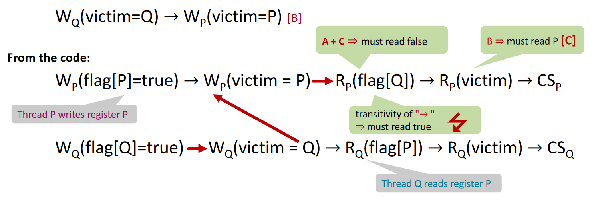

### Filter Lock
```
int[] level(#threads), int[] victim(#threads)

lock (me) {
  for (int i = 1; i < n; i++) {
    level[me] = i;
    victim[i] = me;
    while (Exists k != me: level[k] >= i && victim[i] == me) {}
  }
}

unlock(me) {
  level[me] = 0;
}
```

- satisfies mutual exclusion
- is deadlock free
- is stravation free
- is not fair (first-come-first-serve)

### Bakery Algorithm
```
volatile int np = 0;
volatile int nq = 0;

Process P                         | Process Q
loop                              | loop
  non-critical section            |   non-critical section
  np = nq + 1                     |   nq = np + 1
  while (nq != 0 && nq < np) {}   |   while(np != 0 && np <= nq) {}
  critical section                |   critical section
  np = 0                          |   nq = 0
```

```
int[0..n-1] label = {0, ... , 0};
boolean[0..n-1] flag = {false, ..., false};

lock(me):
  flag[me] = true;
  label[me] = max(label[0], ..., label[n - 1]) + 1;
  while(Exists k != me: flag[k] && (k, label[k]) < (me, label[me])) {}

unlock(me):
  flag[me] = false;
```

### Spinlocks in Java
#### TAS Lock
```Java
public class TASLock implements Lock {
  AtomicBoolean state = new AtomicBoolean(false);

  public void lock() {
    while(state.getAndSet(true)) {}
  }

  public void unlock() {
    state.set(false);
  }
}
```
- has sequential bottleneck
- threads fight for the bus during call of getAndSet
- cache coherency protocol invalidates cached copies of the lock on other processors

#### TATAS Lock
```Java
public class TATASLock implements Lock {
  public void lock() {
    do
      while(state.get()) {}
    while (!state.compareAndSet(false, true));
  }
  public void unlock() {
    state.set(false);
  }
}
```
- many threads fight for access to the same resource
- slows down progress globally and locally

#### Lock with sequential Backoff
```Java
public void lock() {
  Backoff backoff = null;
  while (true) {
    while (state.get()) {}; // spin reading only (TTAS)
    if (!state.getAndSet(true)) // try to acquire, returns previous val
      return;
    else { // backoff on failure
      try {
        if (backoff == null) // allocation only on demand
          backoff = new Backoff(MIN_DELAY, MAX_DELAY);
        backoff.backoff();
      } catch (InterruptedException ex) {}
    }
  }
}
```

```Java
class Backoff {
  public void backoff() throws InterruptedException {
    int delay = random.nextInt(limit);
    if (limit < maxDelay) { // double limit if less than max
      limit = 2 * limit;
    }
    Thread.sleep(delay);
  }
}
```

### Deadlock and Livelocks
Let the red arrows denote the relation that a thread $T$ attempts to acquire resource $R$. Red the green arrow denote the relation that a resource $R$ is held by thread $T$.

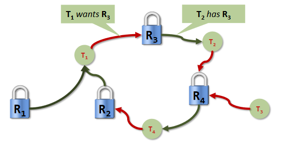

$$
T_1 \ldots T_n \ \text{deadlock} \iff \text{Graph contais cycle}
$$

**Deadlock detection**: Finding cycles in the dependency graph.

**Deadlock avoidance**: Techniques to ensure a cycle can never arise.
- two-phase locking with retry (release when failed)
- resource ordering (global state)

TODO: State diagrams for deadlocks, starvation and livelocks

### State Diagram
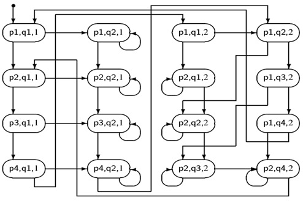

```
initial: turn = 1

P                           | Q
p1: Non-critical section P  | q1: Non-critical section Q
p2: while wutn != 1         | q2: while turn != 2
p3: CS                      | q3: critical section
p4: turn = 2                | q4: turn = 1
```

- Mutual exclusion: state (p3, q3, _) is not reachable
- Progress: There exists a path for P such that state (p3, _, _) is reachable from (p2, _, _). Typical counterexamples: Deadlocks and livelocks
- No starvation: Possible staration reveals itself as cycles in the state diagram

### Semaphores
```
acquire(S) {
  wait until S > 0
  dec(S)
}

release(S) {
  inc(S)
}
```

> Both operations happen atomically.

A simple lock can be built with a semaphore of value 1 (e.g. `sem_mutex = new Semaphore(1l)`).

**Why are semaphores and locks problematic?**: Sempahores are unstructured. Correct use requires high level of discipline. Easy to introduce deadlocks with semaphores. We need a lock that we can temporarily escape from when waiting on a condition: Monitors.

#### Semaphores without Spinning
```
acquire(S) {
  if (S > 0) {
    dec(s)
  } else {
    put(queue, self.thread);
    block(self.thread);
  }
}

release(S) {
  if (queue.isEmepty()) {
    inc(S)
  } else {
    p = get(queue)
    unblock(p)
  }
}
```

### Barries (Two-Phase Barrier)
```
initial: 
mutex=1; barrier1=0; barrier2=1; count=0

acquire(mutex)
  count++;
  if (count==n)
    acquire(barrier2); release(barrier1)
release(mutex)

acquire(barrier1); release(barrier1);
// barrier1 = 1 for all processes, barrier2 = 0 for all processes
acquire(mutex)
  count--;
  if (count==0)
    acquire(barrier1); release(barrier2)
release(mutex)
acquire(barrier2); release(barrier2)
// barrier1 = 0 for all processes, barrier2 = 1 for all processes
```

### Monitors
Abstract data structure equipped with a set of operations that run in mutual exclusion. 

If a condition does not hold, it allows the following operations:
- Release the monitor lock
- Wait for the condition to become true
- Singaling mechanism to avoid busy-loops (spinning)

### Java Interface Lock
Java offers the Lock interface for more flexibility.
```Java
final Lock lock = new ReentrantLock();
```
Java locks provice conditions thatn can be instantiated:
```Java
Condition notFull = lock.newCondition();
```
It support many operations:
- `.await()` - the current thread waits until condition is signaled
- `.signal()` - wakes up one thread waiting on this condition
- `.signalAll()` - wakes up all threads waiting on this condition

### Producer / Consumer Pattern
Can be used to build data-flow paralell programs. 
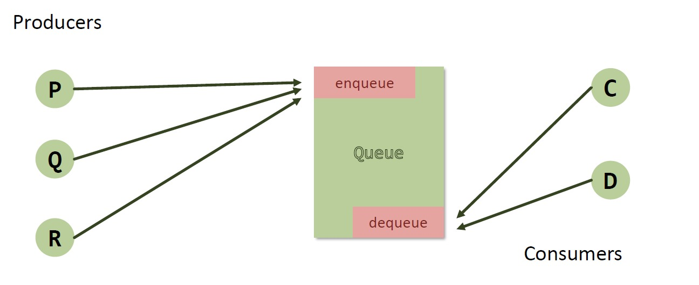

#### Produced / Consumer circular queue
```Java
import java.util.concurrent.Semaphore;
class Queue {
  int in, out, size;
  long buf[];
  Semaphore nonEmpty, nonFull, manipulation;
  
  Queue(int s) {
    size = s;
    buf = new long[size];
    in = out = 0;
    nonEmpty = new Semaphore(0); // use the counting feature of semaphores!
    nonFull = new Semaphore(size); // use the counting feature of semaphores!
    manipulation = new Semaphore(1); // binary semaphore
  }

  private int next(int i) {
    return (i + 1) % size;
  }

  void enqueue(long x) {
    try {
      nonFull.acquire();
      manipulation.acquire();
      buf[in] = x;
      in = next(in);
    }
    catch (InterruptedException ex) {}
    finally {
      manipulation.release();
      nonEmpty.release();
    }
  }

  long dequeue() {
    long x=0;
    try {
      nonEmpty.acquire();
      manipulation.acquire();
      x = buf[out];
      out = next(out);
    }
    catch (InterruptedException ex) {}
    finally {
      manipulation.release();
      nonFull.release();
    }
    return x;
  }

  public boolean isFull() {
    return (in+1) % size == out;
  }

  public boolean isEmpty() {
    return in == out;
  }
```

#### Producer / Consumer queue with monitor in Java
```Java
class Queue {
  int in, out, size;
  long buf[];

  Queue(int s) {
    size = s;
    buf = new long[size];
    in = out = 0;
  }

  synchronized void enqueue(long x) {
    while (isFull())
      try {
        wait();
      } catch (InterruptedException e) { }
    doEnqueue(x);
    notifyAll();
  }


  synchronized long dequeue() {
    long x;
    while (isEmpty())
      try {
        wait();
      } catch (InterruptedException e) { }
    x = doDequeue();
    notifyAll();
    return x;
  }

  public boolean isFull() {
    return (in+1) % size == out;
  }

  public boolean isEmpty() {
    return in == out;
  }
}
```

#### Producer / Consumer with explicit Lock
```Java
class Queue {
  int in=0, out=0, size;
  long buf[];
  final Lock lock = new ReentrantLock();
  final Condition notFull = lock.newCondition();
  final Condition notEmpty = lock.newCondition();

  Queue(int s) {
    size = s;
    buf = new long[size];
  }

  void enqueue(long x) {
    lock.lock();
    while (isFull())
      try {
      notFull.await();
      } catch (InterruptedException e){}
    doEnqueue(x);
    notEmpty.signal();
    lock.unlock();
  }

  long dequeue() {
    long x;
    lock.lock();
    while (isEmpty())
      try {
      notEmpty.await();
      } catch (InterruptedException e){}
    x = doDequeue();
    notFull.signal();
    lock.unlock();
    return x;
  }
}
```

#### Producer / Consumer, Sleeping Barber Variant
```Java
  class Queue {
  int in=0, out=0, size;
  long buf[];
  final Lock lock = new ReentrantLock();
  int n = 0; final Condition notFull = lock.newCondition();
  int m; final Condition notEmpty = lock.newCondition();

  Queue(int s) {
    size = s; m=size-1;
    buf = new long[size];
  }

  void enqueue(long x) {
    lock.lock();
    m--; if (m<0)
      while (isFull())
        try { notFull.await(); }
        catch(InterruptedException e){}
    doEnqueue(x);
    n++;
    if (n<=0) notEmpty.signal();
      lock.unlock();
  }


  long dequeue() {
    long x;
    lock.lock();
    n--; if (n<0)
      while (isEmpty())
        try { notEmpty.await(); }
        catch(InterruptedException e){}
    x = doDequeue();
    m++;
    if (m<=0) notFull.signal();
      lock.unlock();
    return x;
  }
}
```

### Reader/Writer lock
The lock’s states fall into three categories:
- not held
- held for writing by one thread
- held for reading by one or more threads

It contains the following methods: `new`, `acquire_write`, `acquire_read`, `release_write`, `release_read`.

In Java a read/write lock can be used as the following:
```Java
ReentrantReadWriteLock lock = new ReentrantReadWriteLock();
Lock readLock = lock.readLock();
Lock writeLock = lock.writeLock();
```

### Lock Granularity
Example with sequential list based set with `add`, `remove` and `find`

```Java
public class Set<T> {
  private class Node {
    T item;
    int key;
    Node next;
  }

  private Node head;
  private Node tail;

  public boolean add(T x) {...};
  public boolean remove(T x) {...};
  public boolean contains(T x) {...};
}
```

- Corase-grained locking
- Fine-grained locking
- Optimistic synchronization
- Lazy synchronization

#### Coarse-grained locking
Lock as much as possible. In this example look the whole list.
Simple, but bottleneck for all threads.
```Java
public synchronized boolean add(T x) {...};
public synchronized boolean remove(T x) {...};
public synchronized boolean contains(T x) {...};
```

#### Fine-grained locking (hand over hand locking)
Split object into pieces with separate locks. No mutual exclusion for algorithms on disjoint pieces. Requires careful consideration of special cases.

When deleteing, the next field of next is ead, i.e., next also has to be proteced. A thread needs to lock both, predecessor and the node to be deleted.

Disadvantages:
- Potentially long sequence of acquire / release before the intended action can take place
- One (slow) thread locking "early nodes" can block another thread wanting to acquire "late nodes"

```Java
public boolean remove(T item) {
  Node pred = null, curr = null;
  int key = item.hashCode();
  head.lock();
  try {
    pred = head;
    curr = pred.next;
    curr.lock();
    try {
      while (curr.key < key) {
        pred.unlock();
        pred = curr; // pred still locked
        curr = curr.next;
        curr.lock(); // lock hand over hand
      }
      if (curr.key == key) {
        pred.next = curr.next; // delete
        return true;
      }
      return false;
    } finally { curr.unlock(); }
  } finally { pred.unlock(); }
}
```

> sentinel at front and end of list prevents an excpetion here.

#### Optimistic synchronization (locking)
Find nodes without locking, then lock nodes and check that everyting is ok. The validation method has to be sophistically constructed, such that all special cases are handled separatly.

```Java
private Boolean validate(Node pred, Node curr) {
  Node node = head;
  while (node.key <= pred.key) { // reachable?
    if (node == pred)
      return pred.next == curr; // connected?
    node = node.next;
  }
  return false;
}
```
Traversals are wait-free and the method has less lock acquisitions. But it needs to traverse the list twice. The `contains()` method needs to acquire locks. It is not starvation free.

#### Lazy synchronization (locking)
Like optimistic synchronization list but traverses only once and the `contains()` never locks.

Idea is to use delete-markers --> invariant: every unmarked node is reachable.
Remove nodes "lazily" after marking

**Key Invariant:** If a node is not marked then it is reachable from head and reachable from its predecessor.

#### Lazy Skip Lists
- Sorted mutli-level list
- Node height probabilistic. No rebalancing.

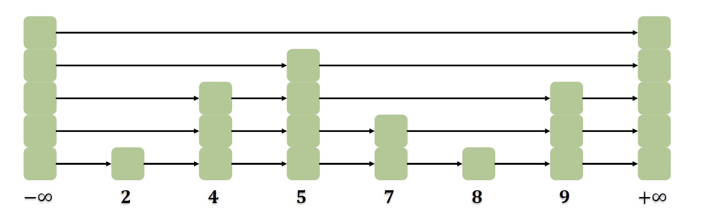
Store predecessor and succesor for each node in each level.

**Add:**
1. Find predecessor(lock-free)
2. Lock predecessors
3. Validate
4. Splice
5. Mark fully linked
6. Unlock
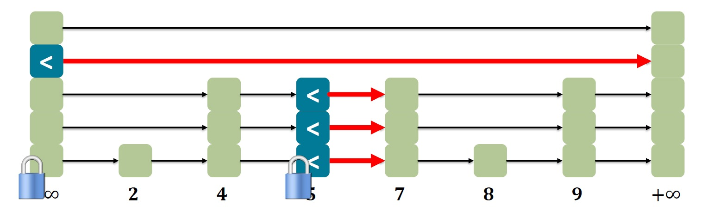

**Remove:**
1. Find predecessors
2. Lock Victim
3. Logically remove victim (mark)
4. Lock predecessors and validate
5. physically remove
6. unlock
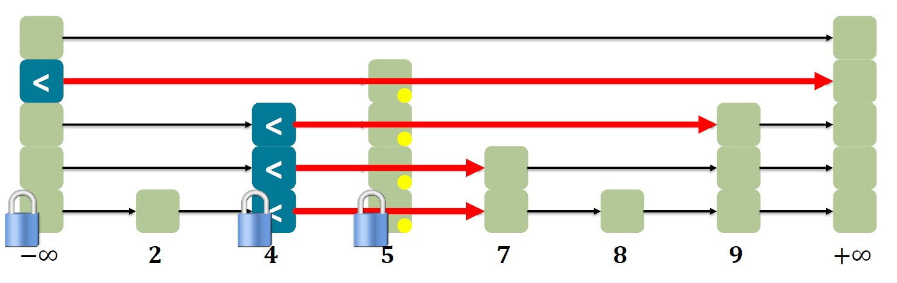

**Contains:**
1. sequential `find|()` & not logically removed & fully linked
2. even if other nodes are removed, it stays reachable
3. contains is `wait-free` (while add and remove are not)


### Disadvantages of locking
Locks are pessimistic by design
- Assume the worst and enforce mutual exclusion

Performance issues
- Overhead for each lock taken even in uncontended case
- Contended case leads to significant performance degradation
- Amdahl’s law!

Blocking semantics (wait until acquire lock)
- If a thread is delayed (e.g., scheduler) when in a critical section → all threads suffer
- What if a thread dies in the critical section
- Prone to deadlocks (and also livelocks)
- Without precautions, locks cannot be used in interrupt handlers

## Programming without Locks
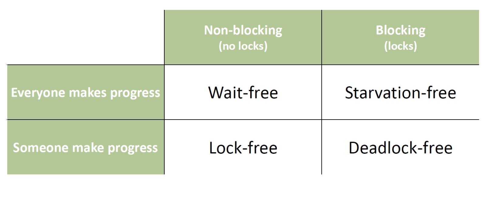

### TAS and CAS
Hardware support for atomic operations. Read-Modify-Write operations which enable implementation of a mutex with $\mathcal{O}(1)$ space.
```
boolean TAS (memref S):
  if (mem[s] == 0) {
    mem[s] = 1;
    return true;

  } else {
    return false;
  }
```

```
int CAS (memref a, int old, int new):
  oldval = mem[a];
  if (old == oldval)
    mem[a] = new;
  return oldval;
```

> Both operations are atomically executed in hardware!

### Non-blocking Stack
To make a non-blocking stack one can use the `Atomicreference<T>` class from java.

```Java
public class ConcurrentStack {
  AtomicReference<Node> top = new AtomicReference<Node>();

  public void push(Long item) {
    Node newi = new Node(item);
    Node head;
    do {
      head = top.get();
      newi.next = head;
    } while (!top.compareAndSet(head, newi));
  }

  public Long pop() {
    Node head, next;
    do {
      head = top.get();
    if (head == null) return null;
      next = head.next;
    } while (!top.compareAndSet(head, next));
    return head.item;
  }
}
```

### Markable References
Java has built in `AtomicMarkableReference<V>`, which looks like: `[ --address-- | mark bit ]`. The marked bit can be used just as in the skip list.

This makes use of the **DCAS** (double compare and swap) in order to be able to check two conditions at once.

To remove an element from the list:
- Set mark bit in next field
- Redirect predecessor's pointer

1. Find element and prev element from key
2. If no such element -> return false
3. Otherweise try to logically delete (set mark bit)
4. If no success, restart from the very beginning
5. Try to physically delete the element, ignore result.

To add an element from the list:
1. Find element and prev element from key
2. If elements already exists, return flase
3. Otherweise create new node, set next / mark bit of th element to be inserted
4. and try to insert. If insertion fails (next set by other fhread or mark bit set), retry.

In both add and remove other threads help to delete the theoretically deleted elements.

In the `find` method if marked nodes are found, delete them, if deletion fails, restart from the beginning.

### Lock-free queues
```Java
// Tail and head both atomic references
public void enqueue(T item) {
  Node node = new Node(item);
  while(true) {
    Node last = tail.get();
    Node next = last.next.get();
    if (next == null) {
      if (last.next.compareAndSet(null, node)) {
        tail.compareAndSet(last, node);
        return;
      }
    } else
      tail.compareAndSet(last, next);
  }
}

public T dequeue() {
  while (true) {
    Node first = head.get();
    Node last = tail.get();
    Node next = first.next.get();
    if (first == last) {
      if (next == null) return null;
      else tail.compareAndSet(last, next);
    } else {
      T value = next.item;
      if (head.compareAndSet(first, next))
        return value;
    }
  }
}
```

### ABA Problem
Occurs when one activity fails to recognize that a single memory location was modified temporarily by another activity and therefore erroneously assumes that the overall state has not been changed.

How to solve?
- DCAS: Not avaible on most platforms
- Garbage Collection: Relies on the existence of a GC, much too slow to use in the inner of a runtime kernel
- Pointer Tagging: Does not cure the problem, rather delay it
- Hazard Pointers
- Transactional Memory

#### Pointer Tagging
Aligned addresses (values of pointers) make some bits avaiable for pointer tagging.
For example "pointer aligned module 32 -> 6 bits avaible for tagging". Each time a pointer is stored ina data structure, the tag is increased by one. Access to a data structure via address x - (x mod 32). This makes the ABA problem very much less probable because now 32 versions of each pointer exist.

#### Hazard Pointers
The ABA problem stems from reuse of a pointer P that has been read by some thread X but not yet written with CAS by the same thead. Modification takes place meanwhile by some other thread Y.
- Before X reads P, it makrs it hazarduous by entering it in one of the n (n=number threads) slots of an array associated with the data structure (e.g., the stack)
- When finished (after the cAS), process X removes P from the array
- Before a process Y tries to reuse P, it checks all entries of the hazard array.

The hazard pointers are place in thread-local storage. When thread-local storage can be replaced by processor-local storage, it scales better.

## Concurrency Theory
**Method Calls**: Is the interval that starts with an **invocation** and ends witha **response**. A method call is called **pending** between invocation and response.

**Invocation**:
```
[Thread] [object].[method]([arguments])
A q.enq(x)
```

**Response**:
```
[Thread] [object]: [result]
A q: void
```

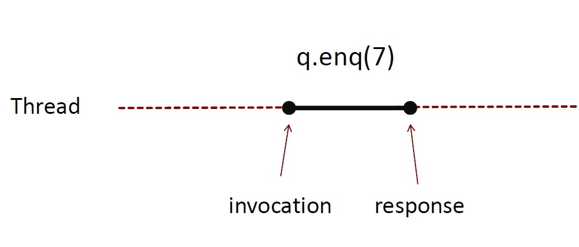

**Sequential Specification**: Tells if a single-theaded, single objects history is legal.
**Precedence**: A method calls precedes another method call if the response event precedes the invocation event. If no precedence then method calls overlap.
**Notation**: $m_0 \to_H m_1$ means method $m_0$ precedes method $m_1$. $\to_H$ is a releation and implies a partial order on $H$. The order is total when $H$ is sequential.

| Sequential | Concurrent |
| --- | --- |
| Meaningful state of objects only between method calls | Method calls can overlap. Object might never be between method calls. |
| Methods described in isolation | All possible interactions with concurrent calls must be taken into account. |
| Can add new methods without affecting older methods. | Must take into account that everything can interact with everything else. |
| Global clock | Object/thread clock |

### History
History H = sequence of invocations and responses
```
   /
   |  A q.enq(3)  \
   |  A q: void   /
   |  A q.enq(5)  <-- pending
H <   B p.enq(4)  \
   |  B p: void   /
   |  B q.deq()   \
   |  B q: 3      /
   \
```

**Complete Subhistory**: History H without its pending invocations.
```
   /
   |  A q.enq(3)  \
   |  A q: void   /
H <   B p.enq(4)  \
   |  B p: void   /
   |  B q.deq()   \
   |  B q: 3      /
   \
```

**Sequential Histories**: Method calls of different threads do not interleave. A final pending invocations is ok.
**Well formed histories**: Per thread projections are sequential.
**Equivalent histories**: $H|A = G|A \land H|B = G|B \implies H \equiv B$
**Legal histories**: If for every object $x$, $H|x$ adheres to the sequential specification of $x$.

#### Projections
**Object Projections** H|q:
```
     /
     |  A q.enq(3)  \
     |  A q: void   /
     |  A q.enq(5)  <-- pending
H|q <   B q.deq()   \
     |  B q: 3      /
     \
```

**Thread projections** H|B:
```
     /
     |  B p.enq(5)
     |  B p:void
H|B <   B q.deq()
     |  B q: 3
     \
```


### Linearizability
Each method should appear to take effect instantaneously between invocation and response events. An object for which this i sture for all possible executions is called **linearizable**.

The obejct is correct if the associated sequential behavior is correct.

The **linearization points** can often be specified, but they may depend on the execution. Some linearization points are when locks are released. Most of the time when something locked or synchronized is accessed.

> When the method shows effect (e.g., updates are gloabbly visible or visibale decisions are made).

History $H$ is linearizable if it can be extended to a history $G$
- appending zero or more responses to pending invocations that took effect
- discarding zero or more pending invocations that did not take effect.

Such that $G$ is equivalent to a legal sequential history $S$ with $\to_G \subset \to_S$. Which means
$$
\to_G = \{a \to c b \to c\} \\
\to_S = \{a \to b, a\to c, b\to c\} \\
\implies \to_G \subset \to_S
$$

> **Composability Theorem**: History $H$ is linearizable $\iff$ for every object $x$, $H|x$ is linearizable.
> **Modularity**: Linearizability of obejcts can be proven in isolation. Independently implmeneted objects can be composed.

**Atomic Registers** have a single linearization point.
$\implies$ Sequentially consistent; every read operation yields most recently written value.
$\implies$ for non-overlapping  oeprations, the realtime order is respected.

### Sequential Consistency
History $H$ is sequentially consistent if it an be extended to a history $G$
- appending zero or more responses to to pending invocations that took effect
- discarding zero or more pending invocations that did not take effect

such that $G$ is equivalent to a legal sequential history $S$.

> $\to_G \subset \to_S$ is not required, i.e., no order across threads required

Requires that operations done by one thread respect program order.
- Cannot re-order operations done by the same thread
- Can re-order non-overlapping operations done by different threads

> Sequential Consistency is not a local property and thus we lose composability.

### Quiescent Consistency
Programs should respect real-time order of algorithms separated by periods of quiescence. Non-overlapping methods required to take effect in their real-time order.

### Consensus (Wait-free)
```Java
public interface Consensus<T> {
  T decide(T value);
}
```

A class $C$ solves **n-thread consensus** if there exists a consensus protocol. Consensus number of $C$: largest $n$ such that $C$ solves n-thread consensus.
#### Requirements
- **wait-free**: consensus returns in finite time for each thread
- **consistent**: all threads decide the same value
- **valid**: the common decision value is some thread's input

$\implies$ linearizability of consensus must be such that first thread's decision is adopted for all threads.

#### Examples
| Object | Consensus Number |
|---|---|
| Wait-free FIFO queue (using `getAndSet`, ...) | 2 |
| Wait-free LIFO stack (using `getAndSet`, ...) | 2 |
| Test-And-Set | 2 |
| Get-And-Set | 2 |
| Get-And-Increment | 2 |
| CAS | $\infty$ |

$\implies$ wait-free FIFO queues, wait-free RMW operations and CAS cannot be implemented with atomic registers.

##### Atomic registers
> **Theorem I**: Atomic Registers have consensus number 1
> **Corolarry**: There is no wait-free implementation of n-thread consensus, $n > 1$, from read-write registers.

##### CAS
> **Theorem II**: Compare-And-Swap has infinite consensus number.

Proof is done by construction, with an `AtomicIntegerArray` which stores all proposed inputs, then `AtomicInteger` which stores the decided value and an `int` which stores the thread ID of the first thread which set the consensus.

##### FIFO queue
> **Theorem**: There is no wait-free implementation of a FIFO queue with atomic registers.

Proof:
- **Given**: A consensus protocol from queue and registers
- **Assumption**: A queue implementation from atomic registers
- **Substitution yields**: A wait-free consensus protocol from atomic registers
- **Contradiction**: Atomic register have consensus number 1.

## Transactional Memory
Let hardware / software handle synchronization. Programmer explicitly defines atomic code sections. 

**Pros**:
- simples and less error-prone code
- higher-level semantics (what vs how)
- composable
- optimistic by design (**does not require mutual exclusion**)

**Properties inherited from database transactions (ACID)**:
- Atomicity 
- Consistency (database remains in a consistent state)
- Isolation (no mutual corruption of data)
- *Durability(transaction effects will survive power loss)*

**Concurrency Control (CC)**: Handles transaction issues (aborting, retrying, etc.). When a transaction aborts, it can be retried automatically or the user is notified.

**Issues**:
- No best semantic for transaction
- Getting good performance is challenging
- I/O operations

### Implementation
**Hardware TM (HTM)**:
- can be fast, but bounded resources
- an often not handle big transactions

**Software TM (STM)**:
- in the parallel programming language
- greater flexibility
- achieving good performance might be challenging

Can be implemented by putting the mutable state into special variables. These variables can only be modified inside a transaction. Everything else else is immutable (or not shared).

#### STM Implementation (Using ScalaSTM)
```Java
class AccountSTM {
  private final Integer id; // account id
  private final Ref.View<Integer> balance;

  AccountSTM(int id, int balance) {
    this.id = new Integer(id);
    this.balance = STM.newRef(balance);
  }

  void withdraw(final int amount) {
    // assume that there are always sufficient funds...
    STM.atomic(new Runnable() { public void run() {
      int old_val = balance.get();
      balance.set(old_val – amount);
    }});
  }

  void deposit(final int amount) {
    STM.atomic(new Runnable() { public void run() {
      int old_val = balance.get();
      balance.set(old_val + amount);
    }});
  }

  public int getBalance() {
    int result = STM.atomic(new Callable<Integer>() {
      public Integer call() {
        int result = balance.get();
        return result;
      }
    });
    return result;
  }

  static void transfer(final AccountSTM a, final AccountSTM b, final int amount) {
    atomic { // insert STM logic here :)
      a.withdraw(amount);
      b.deposit(amount);
    }
  }

  static void transfer_retry(final AccountSTM a, final AccountSTM b, final int amount) {
    atomic { // Insert STM logic here :)
      if (a.balance.get() < amount)
        STM.retry(); // Abort transaction and retry
      a.withdraw(amount);
      b.deposit(amount);
    }
  }
}
```

#### Clock-based STM
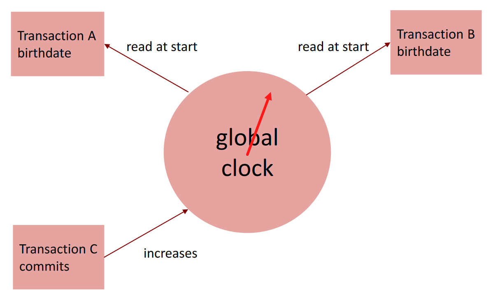

Transaction uses a local read-set and a local write-set holding all locally read and written objects. 
- **Transaction calls read**:
  - Check if the object is in the write set $\implies$ return this (new) version
  - Otherwise check if object's time stamp $\leq$ transaction's birthdate, if not throw aborted exception, otherweise add new copy of the object to the read set
- **Transaction calls write**
  - If object is not in write set, create a copy of it in the write set
- **Commit**:
  - Lock all objects of read- and write-set
  - Check that all objects in the sets provice a time stamp $\leq$ birthdate of the transaction, ortherwise abort
  - Increment and get the value $T$ of the current global lock
  - Copy each element of the write set back to global memory with timestamp $T$
  - Release all locks and return

### Isolation Methods
**Strong Isolation**: transation guarantess are still maintained.
**Weak Isolation**: transaction guarantees are not maintained.

### Nestings
#### Flattened Nesting
```
atomic {
  atomic {
    atomic {       atomic {
      ...     ==>    ...
    }              }
  }
}
```
- inner aborts $\implies$ outer aborts
- inner commits $\implies$ changes visible only if outer commits

#### Closed Nesting
- inner aborts $\not\Rightarrow$ outer aborts
- inner commits $\implies$ changes visible for outer transaction
- inner commits $\implies$ changes not visible for other transactions
- outer commits $\implies$ changes of inner transactions become visible globally

## Distributed Memory and Message Passing
Private isolated mutable state for each thread. Tasks cooperate via message passing.
The states can be distributed on different memories, where memory systems communicate with a bus.

Concurrent Message Passing Methods:
- CSP: Communicating Sequential Processes
- Actor programming model
- MPI (Message Passing Interface)

**Synchronous Messages**: Sender blocks until message is received
**Asynchronous Mesages**: Sender does not block (fire-and-forget) but are placed into buffer for receiver to get instead (mail-box analogy)

### The Actor Model
Provides dynamic interconnection topology with actors (agent that maps communication to a finite set of states/actors/communications)
- dynamically configure actor graph during runtime (add channels)
- dynamically allocate resources
- direct message sending by direct naming (without port/channel/queue/etc.)
- Asynchronous Message Passing

### Event Driven Programming Model
Actors react to messages (events) with event listeners/handlers. E.g. graphical user interface (user presses OK Button $\to$ do something)

### Communicating Sequential Processes
- Synchronisation and communication between parallel processes with message passing
  - Symbolic channels between sender and receiver
  - Read/Write requires a rendevous (synchronous)
  - Intermediary entity (port / channel) to address send destination
  - `send()` specifies the port to which the message is sent
  - `receive()` specifies a port number and waits for the first message that arrives at port

### Message Passing Interface (MPI)
- Hides Software/Hardware details
- Portable, flexible
- Implemented as a library

Works with SPMD (Single Program Multiple Data). Compile one program and by case distinctions evaluate the work load.

Can either be used synchronous or asynchronous, which defines communication between sender and receiver.

**Blocking**: Return after local actions are complete, thought the message transfer may not have been completed.
**Non-Blocking**: Return immediately.

> Blocking/Non-Blocking is about handling data to be sent / received. Default in MPI is **blocking** $\implies$ deadlock potential deadlock
```
Process 0           Process 1
----------------    ----------------
Send(1)             Send(0)
Recv(1)             Recv(0)
```
"unsafe" because it depends on the availability of system buffers in which to store the data sent until it can be received.

Solution for problem:
```
Process 0           Process 1
----------------    ----------------
Send(1)             Recv(0)
Recv(1)             Send(0)

or
Sendrecv(1)         Sendrecv(0)     <== supply receive buffer at send

or
Bsend(1)            Bsend(0)        <== supply own space as buffer for send
Recv(1)             Recv(0)

or
Isend(1)            Isend(0)
Irecv(1)            Irecv(0)
Waitall             Waitall         <== non-blocking
```

#### MPI Communicators
- Defines set of processes that are allowed to ocmmunicate with each other
- The group of all processes is initialy given the name `MPI_COMM_WORLD`, which is the communicator all processes initially are.
- MPI processes can be collected into groups.
- **Comunicator = Group + Color**
- A process is identified by its communicator dedicated **rank**.
- The rank of processes are assciated with a communicator, numbered from $0$ to $n-1$

#### MPI in Java
In general no synchronization, which allows local progress, but requires local storage for messages.

Synchronous sending/receiving can be done with `Ssend` and `Recv`, which wait until complete message canbe accepted by the receiving process befor ecompleting the send.

**Get Process rank**:
```Java
public static void main(String args []) throws Exception {
  MPI.Init(args);
  int rank = MPI.COMM_WORLD.Rank();
  MPI.Finalize();
}
```

**Send Messages**
```Java
void Communicator.send(
  Object buffer,         // pointer to data to be sent
  int offset,
  int count,             // number of elements to be sent
  Datatype datatype,     // datatype of data
  int dest,              // destination process id
  int tag                // data tag id
)
```

**Receive Message**
```Java
void Communicator.send(
  Object buffer,         // Pointer to the buffer to receive to
  int offset,
  int count,             // number of items to be received
  Datatype datatype,     // datatype of data
  int src,               // source process id or MPI_ANY_SOURCE
  int tag                // data id tag or MPI_ANY_TAG
)
```

**Reduce - Collective Computation**
```Java
public void Reduce(
  Object sendbuffer,     // Pointer to data to be sent
  int sendoffset,
  Object receivebuffer,  // Pointer to the buffer to receive to
  int recvoffset,
  int count,             // number of items
  Datatype datatype,     // datatype of data
  Op op,                 // operation to be done
  int root               // rank of root
)
```
```
P0 [A| | | ]       Reduce       [A+B+C+D]
P1 [B| | | ]    ----------->    [ | | | ]
P2 [C| | | ]                    [ | | | ]
P3 [D| | | ]                    [ | | | ]
```

**Broadcast - Collective Data Movement**: Send data to all processes in the communicator.
```
P0 [A| | | ]     Broadcast      [A| | | ]
P1 [ | | | ]    ----------->    [A| | | ]
P2 [ | | | ]                    [A| | | ]
P3 [ | | | ]                    [A| | | ]
```

**Allreduce - Collective Computation**
```Java
public void Allreduce(
  Object sendbuffer,     // Pointer to data to be sent
  int sendoffset,
  Object receivebuffer,  // Pointer to the buffer to receive to
  int recvoffset,
  int count,             // number of items
  Datatype datatype,     // datatype of data
  Op op,                 // operation to be done
)
```
```
P0 [A| | | ]     Allreduce      [A+B+C+D]
P1 [B| | | ]    ----------->    [A+B+C+D]
P2 [C| | | ]                    [A+B+C+D]
P3 [D| | | ]                    [A+B+C+D]
```

> Allreduce $\neq$ Reduce + Broadcast, since Allreduce uses butterfly mechanism

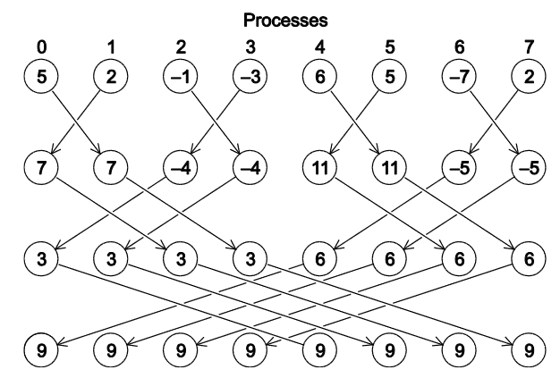

**Scatter/Gather - Collective Data Movement**
```
P0 [A|B|C|D]       Scatter      [A| | | ]
P1 [ | | | ]    ----------->    [B| | | ]
P2 [ | | | ]       Gather       [C| | | ]
P3 [ | | | ]    <-----------    [D| | | ]
```

**More Collective Data Movement**
```
P0 [A| | | ]     Allgather      [A|B|C|D]
P1 [B| | | ]    ----------->    [A|B|C|D]
P2 [C| | | ]                    [A|B|C|D]
P3 [D| | | ]                    [A|B|C|D]
```
```
P0 [A|B|C|D]      Alltoall      [A|E|I|M]
P1 [E|F|G|H]    ----------->    [B|F|J|N]
P2 [I|J|K|L]                    [C|G|K|O]
P3 [M|N|O|P]                    [D|H|L|P]
```
> `Alltoall` is just like a matrix transpose!

## Parallel Sorting
- No comparison sort can have worst-case better than the height of a binary tree with $n!$ leaves
- Height of this tree is $\Omega(n \log n) \implies$ Sorting is $\Omega(n \log n)$

### Sorting Networks
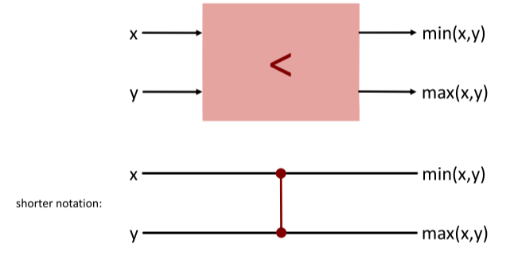

> **Zero-one-principle**: If a network with $n$ input lines sort all $2^n$ sequences of $0$s and $1$s into non-decreasing order, it will sort any arbitrary sequence of $n$ numbers in non-decreasing order.

$$
x \ \text{not sorted by} \ N \implies f(x) \in \{0,1\}^n \ \text{not sorted by} \ N \\
\iff \\
\forall f \in \{0, 1\}^n: f \ \text{sorted by} \ N \implies \forall x: x \ \text{sorted by} \ N
$$

## Implications
- wait-freedom $\implies$ lock-freedom $\implies$ system-wide progress
- wait-freedom $\implies$ starvation freedom
- lock-freedom $\not\Rightarrow$ starvation freedom
- lock-free $\implies$ deadlock-free
- fair $\implies$ starvation-free $\implies$ deadlock/livelock-free
- correct lock implmeentation $\implies$ mutual exclusion, starvation-free and deadlock'livelock-free
- program does not use locks $\implies$ lock-free

## Keywords
- **Mutual Exclusion**: Preventing more than one thread from being in a critical section, i.e. to execute a piece of code, at a given moment in time.
- **Lockout**: Needlessly preventing a thread from entering a critical section.
- **Starvation**: A thread starves if it can never enter a/any critical section.
- **Deadlock**: Circular waiting/blocking (no instructions are executed/CPU time is used) between threads, so that the system (union of all threads) cannot make any progress anymore.
- **Livelock**: A situation in which all threads starve by infinitely often try to enter a critical section, but never succeeding. Similar to a deadlock, the system makes no real progress, although the threads execute statements/use CPU time.
- **Producer/Consumer**: The producer is a cyclic process and each time it goes through its cycle it produces a certain portion of information, that has to be processed by the consumer. The consumer is also a cyclic process and each time it goes through its cycle, it can process the next portion of information, as has been produced by the producer.
- **Readers/Writers**: Some threads may read and some may write, with the constraint that no thread may access the shared resource for either reading or writing while another thread is in the act of writing to it. (In particular, we want to prevent more than one thread modifying the shared resource simultaneously and allow for two or more readers to access the shared resource at the same time).
- **Thread**: In general, an independent (i.e. capable of running in parallel) unit of computation that executes a piece of code. 
- **Process**: Independently running instance of a program/application, typically on the operation system level. Similar to a thread, but usually more heavy-weight (since a whole program) and encapsulated in memory.
- **Process Control Block (PCB)**: Data structure used by computer operating systems to store all the information about a process.
- **Inter-Process Communication (IPC)**: The mechanisms an operating system provides to allow the processes to manage shared data. 
- **Thread Mapping**: How a Java/JVM thread is related to an operating system thread. In native threading (most common), each JVM thread is mapped to a dedicated operating system thread. In green threading, the JVM maps several threads to a single operating system thread.
- **Interleaving**: Given multiple threads, each executing a sequence of instructions, an interleaving is a sequence of instructions obtained from merging the individual sequences. A sequentially consistent interleaving is one where the relative order of statements from one thread is preserved.
- **Weak Memory Model**: Any load or store operation can effectively be reordered with any other load or store operation, as long as it would never modify the behavior of a single, isolated thread.
- **Strong Memory Model**: A strong hardware memory model is one in which every machine instruction comes implicitly with acquire and release semantics. As a result, when one CPU core performs a sequence of writes, every other CPU core sees those values change in the same order that they were written.
- **Busy Waiting**: Occurs when a thead busily (actively) waits, e.g. by spinning in a loop, for a condition to become true. In the opposite scenario, the thread sleeps (i.e. is blocked; in Java: join(), wait()) until the condition becomes true. Trade-off: busy waiting uses up CPU time, whereas blocking may cause additional context switches.
- **Context Switch**: Given a computation unit (CPU), a context switch denotes the action of switching the unit from one computation to another. Typically refers to switching between processes, but can also refer to switching between threads. Depending on the size of the context ("large" for a process, "small" for thread), a context switch might be computationally expensive, i.e. require comparably much CPU time.
- **Bad Interleaving**: An interleaving that yields a problematic or otherwise undesirable computation. E.g. an incorrect result, a deadlock or non-deterministic output.
- **Safety Property**: Property of a system: "nothing bad ever happens". Can be violated in finite time. Exceptions, absence of deadlocks, and mutual exclusion are typical safety properties. Will be formally defined in Formal Methods using temporal logic.
- **Liveness Property**: Property of a system: "something good eventually happens". Can only be violated in infinite time. Infinite loops and starvation are typical safety properties. Will be formally defined in Formal Methods using temporal logic.
- **Critical Section**: A piece of code that, in order to guarantee correct program execution, may only be executed by one thread at a time.
- **Reentrancy**: A lock is reentrant if it can be acquired (and released) multiple times by the same thread. If a lock is non-reentrant, trying to acquire it again might cause an exception or other problems.
- **Shared Resource**: Any resource (memory location, input source, output sink, ...) shared by more than one thread.
- **Atomic**: A statement or instruction is (truly) atomic if it is executed by the CPU in a single, non-interruptible step.
- **Locality**:
  - Data locality/locality of reference: related storage locations (spatial) are often accessed shortly after each other (temporal)
  - (Modularity/Encapsulation: reason locally, e.g. one thread at a time)
- **Memory Model**: A memory model provides guarantees for the effects of memory  perations.
  - leaving optimization possibilities for hardware and compiler
  - but including guidelines for writing correct multithreaded programs
- **Sentinel**: A filler object used to prevent special cases for some data structures.
- **Lock-Freedom**: At least on e thread always makes progress even if other rthreads run concurrently. Implies sytem-wide progress but not greedom from starvation.
- **Wait-freedom**: All threads eventually make progress. Implies freedom from starvation.
- **Fair**: Threads acquire the lock in the order they requested (FIFO)